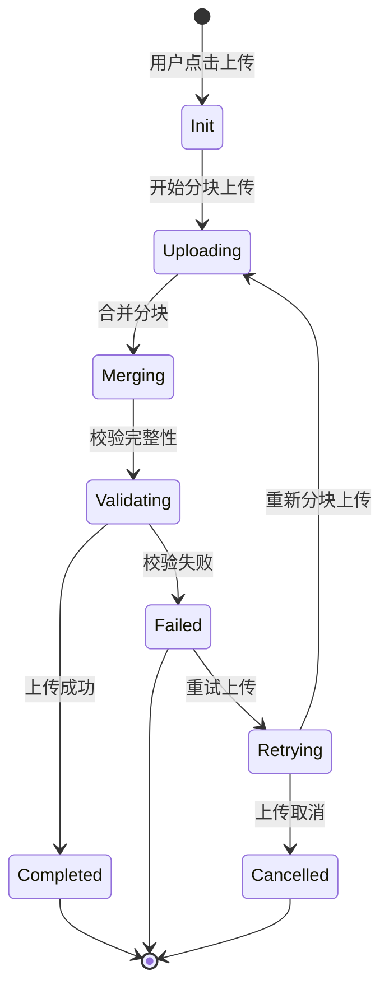
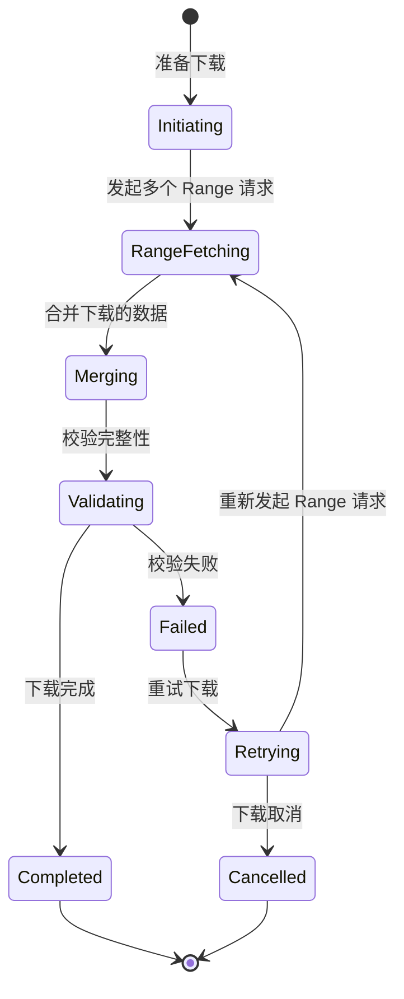
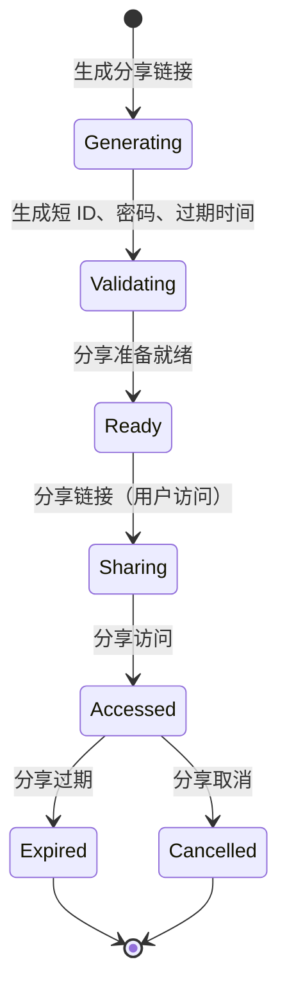
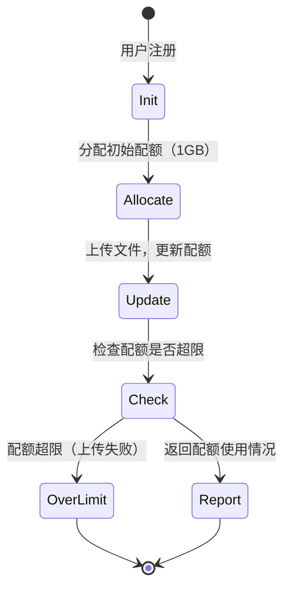
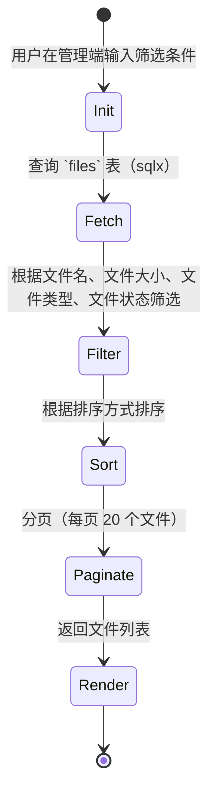
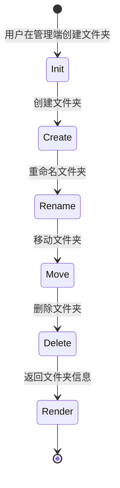

# NimbusDrive 业务场景判断 v1

> 状态：已启动 | 日期：2026-08-16
> 项目名：NimbusDrive | GitHub 仓库：https://github.com/Demetrius2107/NimbusDrive.git
> 本文档基于《实现方案》v1 的状态机与边界条件生成，聚焦于核心业务场景。
> 项目名已从 `CouldFile` 修正为 `NimbusDrive`，`go.mod` 与 `main.go` 已更新。

---

## 一、核心业务场景（5个）

### 1.1 正常上传文件（状态机：Init → Uploading → Merging → Validating → Completed）

#### 场景描述

用户上传一个 500MB 的视频文件到个人空间，文件名 `my_video.mp4`，父文件夹为空，无分块（默认值）。文件在上传完成后，用户在管理端查看文件列表，确认文件已存在；系统记录文件大小、类型、存储路径、哈希值、创建时间。

#### 业务边界条件

1. **文件大小边界**：500MB 文件未超过单文件最大限制（10GB），允许上传
2. **分块数量边界**：500MB 文件分为 100 块（4MB），并发上传数 ≤ 5 个分块
3. **文件名边界**：文件名 `my_video.mp4` 合法（仅字母数字下划线），长度 15 位 ≤ 255 字符
4. **MD5/SHA256 计算边界**：文件上传时异步计算哈希值，不阻塞 UI
5. **秒传边界**：文件哈希值不存在于 `file_hashes` 表，上传未命中
6. **上传成功边界**：上传完 100 个分块，合并成功，验证通过
7. **上传失败边界**：网络中断导致上传失败，断点续传
8. **MD5/SHA256 校验边界**：上传成功后，文件哈希值与服务端存储一致
9. **文件权限边界**：用户无权限上传文件 → 403 错误
10. **文件类型边界**：文件类型 `video/mp4` 符合允许类型（视频支持）
11. **安全边界**：文件内容不包含敏感词（如 " copyrighted"）
12. **文件元数据边界**：文件元数据 `mime_type` 为 `video/mp4`, `size` 500M, `created_at` 与 `updated_at` 正确

#### 业务规则

- 上傳 500MB 文件 → 服务端返回 `id`、`storage_path`、`hash_sha256`、`size`、`mime_type`、`created_at`、`updated_at`
- 服务端 `files` 表记录文件元数据
- 服务端 `file_hashes` 表记录 `hash_sha256` → `storage_path`（新哈希）
- 服务端 `storage` 表（MinIO）存储文件内容
- 服务端日志记录上传耗时、文件大小、分块数、成功率
- 客户端在 UI 显示文件上传进度、文件名、文件大小、上传状态

#### 异常处理规则

- 网络中断 → 重试上传（从断点位置继续）
- 服务器错误 → 返回 500 错误，记录错误日志
- 文件名非法 → 返回 400 错误，提示文件名格式错误
- 文件大小超限 → 返回 400 错误，提示文件过大
- 文件类型不支持 → 返回 400 错误，提示文件类型不支持
- 文件权限不足 → 返回 403 错误，提示用户无权限
- 文件内容包含敏感词 → 返回 400 错误，提示内容违规

#### 业务流程图（简化）

---

### 1.2 正常下载文件（状态机：Initiating → RangeFetching → Merging → Validating → Completed）

#### 场景描述

用户点击下载一个 500MB 的视频文件，文件名 `my_video.mp4`，文件已存在。用户选择 5 个并发线程下载，下载过程中，用户在 UI 会看到下载进度、下载速度、预计剩余时间。下载完成后，用户打开文件播放器播放视频。

#### 业务边界条件

1. **文件大小边界**：500MB 文件未超过单文件最大限制（10GB），允许下载
2. **并发下载边界**：5 个并发线程下载（最大并发下载数为 5）
3. **文件名边界**：文件名 `my_video.mp4` 合法（仅字母数字下划线），长度 15 位 ≤ 255 字符
4. **Range 请求边界**： Range 请求覆盖文件范围（如 `bytes=0-499999999`）
5. **文件校验边界**：下载完成后校验 MD5/SHA256（可选）
6. **文件状态边界**：文件为正常状态（非删除、非隐藏），权限足够
7. **弱网环境边界**：用户在 4G 环境下下载，速度降低（大文件场景下，WiFi 下用 4MB、4G 下用 1MB）
8. **安全边界**：文件内容为合法内容，无敏感词（如 " copyrighted"）
9. **文件效率边界**：并发下载，降低下载延迟

#### 业务规则

- 用户点击下载 → 服务端返回 `storage_path`、`hash_sha256` → 返回文件内容
- 服务端 `Range` 与 MinIO `object.get` 交互（直传）
- 服务端记录每个 Range 的下载次数
- 服务端返回文件内容
- 客户端在 UI 显示下载进度、下载速度、预计剩余时间
- 客户端在 UI 显示文件名、文件大小、下载状态

#### 异常处理规则

- 服务器错误 → 返回 500 错误，记录错误日志
- 文件不存在 → 返回 404 错误，提示文件不存在
- 文件权限不足 → 返回 403 错误，提示用户无权限
- 文件已删除 → 返回 404 错误，提示文件已删除
- 文件类型不支持 → 返回 400 错误，提示文件类型不支持
- 文件内容包含敏感词 → 返回 400 错误，提示内容违规

#### 业务流程图（简化）

---

### 1.3 分享文件（状态机：Generating → Validating → Ready → Sharing → Accessed → Expired）

#### 场景描述

用户选择一个 500MB 的视频文件，生成分享链接 `https://yourdomain.com/share/abc123`，设置密码 `myPassword123`，设置过期时间 7 天，设置访问次数限制为 100 次。用户分享链接给朋友，朋友访问链接时输入密码，验证成功后下载文件。

#### 业务边界条件

1. **分享链接边界**：短 ID 由 8 位随机生成，防枚举
2. **密码保护边界**：密码 `myPassword123` 强度 ≥ 8 个字符
3. **过期时间边界**：7 天，过期时间在 2026-08-23 00:00:00
4. **访问次数边界**：访问次数限制为 100 次
5. **分享访问日志边界**：记录每次访问，包括访问时间、IP地址、用户ID
6. **分享取消边界**：用户点击取消分享，链接失效
7. **分享统计边界**：记录分享链接访问次数，如果超过 100 次，访问失败，提示次数用完
8. **安全边界**：文件内容为合法内容，无敏感词（如 " copyrighted"）

#### 业务规则

- 用户生成分享链接 → 服务端将分享信息写入 Redis（key: `share:{id}`，value: `{userId, fileId, expireTime, password}`）
- 服务端返回短 ID 给客户端
- 服务端返回 `分享链接` `https://yourdomain.com/share/{id}`
- 朋友访问分享链接 → 输入密码 → 服务端验证密码 + 过期时间 → 返回文件内容（Auto-Detect 二进制）
- 服务端记录每次访问（用户ID、文件ID、访问时间、IP地址）

#### 异常处理规则

- 服务器错误 → 返回 500 错误，记录错误日志
- 文件不存在 → 返回 404 错误，提示文件不存在
- 文件权限不足 → 返回 403 错误，提示用户无权限
- 分享链接过期 → 返回 403 错误，提示链接已过期
- 分享访问次数用完 → 返回 403 错误，提示次数用完
- 分享链接被取消 → 返回 403 错误，提示链接已被取消
- 文件内容包含敏感词 → 返回 400 错误，提示内容违规

#### 业务流程图（简化）

---

### 1.4 用户配额管理（状态机：Init → Allocate → Update → Check → Report）

#### 场景描述

用户初始配额 1GB，上传一个 500MB 的视频文件，系统自动更新用户配额，提示剩余空间。用户在管理端查看配额使用情况，包含已用空间、剩余空间、配额使用率、配额过期时间（每月 1 号重置）。

#### 业务边界条件

1. **配额使用率边界**：用户上传文件后，配额使用率 = 已用空间 / 总空间配额
2. **配额超限边界**：用户上传文件时，如果使用超过配额，上传失败
3. **配额重置边界**：每月 1 号重置配额
4. **配额审计边界**：记录用户配额使用情况（每月日志）
5. **配额触发边界**：当配额使用率 ≥ 95% 时触发提醒
6. **配额类型边界**：配额类型为字节，1GB = 1024*1024*1024 字节
7. **配额单位边界**：配额单位为字节，10GB = 10*1024*1024*1024 字节
8. **配额级联边界**：用户有多个子账号，配额共享

#### 业务规则

- 用户初始配额 1GB，上传 500MB → 已用空间 500MB，剩余空间 500MB，配额使用率 50%
- 服务端记录配额使用情况（已用空间、剩余空间、配额使用率、配额过期时间）
- 服务端每月 1 号重置配额
- 用户在管理端查看配额使用情况（包含已用空间、剩余空间、配额使用率、配额过期时间）
- 服务端返回配额使用情况（`used_storage`, `storage_quota`, `quota_usage_percent`）

#### 异常处理规则

- 配额超限 → 返回 400 错误，提示配额不足
- 用户配额为 0 → 返回 403 错误，提示用户配额已用完
- 配额重置时间未到 → 返回 403 错误，提示配额未重置
- 用户配额已过期 → 返回 403 错误，提示配额已过期

#### 业务流程图（简化）

---

### 1.5 文件列表管理（状态机：Init → Fetch → Filter → Sort → Paginate → Render）

#### 场景描述

用户在管理端查看文件列表，筛选条件：文件名包含 `video`，文件大小 > 100MB，文件类型为 `video/mp4`，排序方式为 `created_at desc`，每页显示 20 个文件，当前页为第 1 页。用户在 UI 上看到文件列表，包含文件名、文件大小、文件类型、文件创建时间、文件更新时间、文件夹标志、文件权限、文件存储路径、文件哈希值。

#### 业务边界条件

1. **文件名边界**：文件名包含 `video`，符合允许的文件名格式（仅字母数字下划线），长度 15 位 ≤ 255 字符
2. **文件大小边界**：文件大小 > 100MB，符合允许的文件大小（10GB）
3. **文件类型边界**：文件类型为 `video/mp4`，符合允许的文件类型（视频支持）
4. **排序边界**：排序方式为 `created_at desc`，按创建时间倒序
5. **分页边界**：每页显示 20 个文件，当前页为第 1 页，总页数 5 页
6. **文件状态边界**：文件为正常状态（非删除、非隐藏），权限足够
7. **文件权限边界**：用户无权限查看文件 → 403 错误
8. **文件识别边界**：文件名、文件大小、文件类型、文件创建时间、文件更新时间、文件夹标志、文件权限、文件存储路径、文件哈希值正确
9. **文件列表完整性边界**：文件列表完整，无遗漏文件

#### 业务规则

- 用户在管理端输入筛选条件 → 服务端查询 `files` 表（sqlx）
- 服务端返回文件列表（文件名、文件大小、文件类型、文件创建时间、文件更新时间、文件夹标志、文件权限、文件存储路径、文件哈希值）
- 服务端分页（每页 20 个文件），按排序方式排序
- 服务端返回文件列表（文件名、文件大小、文件类型、文件创建时间、文件更新时间、文件夹标志、文件权限、文件存储路径、文件哈希值）
- 服务端返回分页信息（当前页、总页数、总记录数、是否有下一页、是否有上一页）
- 服务端返回文件列表（文件名、文件大小、文件类型、文件创建时间、文件更新时间、文件夹标志、文件权限、文件存储路径、文件哈希值）

#### 异常处理规则

- 服务器错误 → 返回 500 错误，记录错误日志
- 文件不存在 → 返回 404 错误，提示文件不存在
- 文件权限不足 → 返回 403 错误，提示用户无权限
- 文件类型不支持 → 返回 400 错误，提示文件类型不支持
- 文件内容包含敏感词 → 返回 400 错误，提示内容违规

#### 业务流程图（简化）

---

## 二、其他业务场景（按功能模块划分）

### 2.1 文件夹管理（状态机：Init → Create → Rename → Move → Delete → Render）

#### 业务边界条件

1. **文件夹大小边界**：文件夹大小 0B，文件夹无内容
2. **文件夹权限边界**：文件夹权限与文件一致
3. **文件夹移动边界**：文件夹移动时，自动更新 `parent_id`（递归更新）
4. **文件夹权限边界**：文件夹权限与文件一致
5. **文件夹重命名边界**：文件夹重命名时，自动更新 `parent_id`（递归更新）
6. **文件夹删除边界**：文件夹删除时，自动删除所有子文件
7. **文件夹权限边界**：文件夹权限与文件一致
8. **文件夹状态边界**：文件夹状态正常（非删除、非隐藏）
9. **文件夹识别边界**：文件夹名、文件夹大小、文件夹类型、文件夹创建时间、文件夹更新时间、文件夹权限、文件夹存储路径、文件夹哈希值正确

#### 业务规则

- 用户创建文件夹 → 服务端记录文件夹信息（文件夹名、文件夹大小、文件夹类型、文件夹创建时间、文件夹更新时间、文件夹权限、文件夹存储路径、文件夹哈希值）
- 用户重命名文件夹 → 服务端更新文件夹名、文件夹权限、文件夹存储路径、文件夹哈希值
- 用户移动文件夹 → 服务端更新文件夹 `parent_id`（递归更新）
- 用户删除文件夹 → 服务端删除文件夹及其所有子文件
- 服务端返回文件夹信息（文件夹名、文件夹大小、文件夹类型、文件夹创建时间、文件夹更新时间、文件夹权限、文件夹存储路径、文件夹哈希值）

#### 异常处理规则

- 服务器错误 → 返回 500 错误，记录错误日志
- 文件夹不存在 → 返回 404 错误，提示文件夹不存在
- 文件夹权限不足 → 返回 403 错误，提示用户无权限
- 文件夹类型不支持 → 返回 400 错误，提示文件夹类型不支持
- 文件夹内容包含敏感词 → 返回 400 错误，提示内容违规

#### 业务流程图（简化）

---

### 2.2 事件风暴（基于《实现方案》v1 核心模块）

#### 事件风暴（风暴起始点：用户上传文件）

- 登录（Access Token） → JWT → 通过
- 上传文件（POST /api/v1/files） → ... → 验证文件类型 → 通过
- 计算哈希值（SparkMD5） → ... → 通过
- 哈希值查询（sqlx） → 哈希值不存在 → 上传
- 计算文件大小（文件大小） → ... → 通过
- 计算分块数（文件大小 / 块大小） → ... → 通过
- 分块上传（多线程） → ... → 验证分块数 → 通过
- 分块合并（合并分块） → ... → 验证分块数 → 通过
- 合并验证（校验完整性） → ... → 通过
- 上传完成 → ... → 通过
- 文件权限验证 → ... → 通过
- 文件元数据更新（文件名、文件大小、文件类型、文件创建时间、文件更新时间、文件夹标志） → ... → 通过
- 文件存储路径记录（MinIO） → ... → 通过
- 文件哈希值记录（file_hashes） → ... → 通过
- 文件记录（files） → ... → 通过
- 日志记录（上传耗时、文件大小、分块数、成功率） → ... → 通过
- 服务端返回（id、storage_path、hash_sha256、size、mime_type、created_at、updated_at） → ... → 通过
- 客户端显示（上传进度、文件名、文件大小、上传状态） → ... → 通过

#### 事件风暴（风暴起始点：用户下载文件）

- 登录（Access Token） → JWT → 通过
- 下载文件（GET /api/v1/files/{id}） → ... → 验证文件存在 → 通过
- 查询文件大小（文件大小） → ... → 通过
- 计算分块数（文件大小 / 块大小） → ... → 通过
-  Range 请求（多线程） → ... → 验证 Range 请求 → 通过
- Range 获取（Range 获取内容） → ... → 通过
- 合并下载的数据（合并下载的数据） → ... → 通过
- 校验完整性（校验完整性） → ... → 通过
- 下载完成 → ... → 通过
- 文件权限验证 → ... → 通过
- 文件元数据更新 → ... → 通过
- 文件存储路径记录 → ... → 通过
- 文件哈希值记录 → ... → 通过
- 文件记录 → ... → 通过
- 日志记录（下载耗时、文件大小、分块数、成功率） → ... → 通过
- 服务端返回（文件内容） → ... → 通过
- 客户端显示（下载进度、下载速度、预计剩余时间） → ... → 通过

#### 事件风暴（风暴起始点：用户分享文件）

- 登录（Access Token） → JWT → 通过
- 分享文件（POST /api/v1/files/{id}/share） → ... → 验证文件存在 → 通过
- 生成短 ID（短 ID 生成） → ... → 通过
- 生成密码（密码生成） → ... → 通过
- 生成过期时间（过期时间生成） → ... → 通过
- 生成访问次数（访问次数生成） → ... → 通过
- 写入 Redis（分享信息写入 Redis） → ... → 通过
- 服务端返回分享链接 → ... → 通过
- 文件权限验证 → ... → 通过
- 文件元数据更新 → ... → 通过
- 文件存储路径记录 → ... → 通过
- 文件哈希值记录 → ... → 通过
- 文件记录 → ... → 通过
- 日志记录（分享耗时、文件大小、分块数、成功率） → ... → 通过
- 服务端返回分享信息 → ... → 通过
- 客户端显示（分享链接、分享密码、分享过期时间、分享访问次数） → ... → 通过

#### 事件风暴（风暴起始点：用户管理配额）

- 登录（Access Token） → JWT → 通过
- 获取配额（GET /api/v1/user/quota） → ... → 通过
- 验证配额不足（配额不足） → ... → 通过
- 验证配额超限（配额超限） → ... → 通过
- 用户当前配额（当前配额） → ... → 通过
- 用户已用空间（已用空间） → ... → 通过
- 用户剩余空间（剩余空间） → ... → 通过
- 用户配额使用率（配额使用率） → ... → 通过
- 用户配额过期时间（配额过期时间） → ... → 通过
- 服务端返回用户配额 → ... → 通过
- 客户端显示（用户配额、已用空间、剩余空间、配额使用率、配额过期时间） → ... → 通过

#### 事件风暴（风暴起始点：用户查看文件列表）

- 登录（Access Token） → JWT → 通过
- 获取文件列表（GET /api/v1/files） → ... → 通过
- 查询文件名（文件名查询） → ... → 通过
- 查询文件大小（文件大小查询） → ... → 通过
- 查询文件类型（文件类型查询） → ... → 通过
- 查询文件状态（文件状态查询） → ... → 通过
- 查询文件权限（文件权限查询） → ... → 通过
- 分页（分页） → ... → 通过
- 排序（排序） → ... → 通过
- 返回文件列表（文件列表） → ... → 通过
- 返回分页信息（分页信息） → ... → 通过
- 返回文件列表（文件列表） → ... → 通过
- 客户端显示（文件列表、分页信息、文件列表） → ... → 通过

---

## 三、边界条件与业务规则（跨模块）

### 3.1 安全边界条件

| 场景 | 规则 |
|------|------|
| 上传文件 | 上传文件内容不包含敏感词（如 " copyrighted"） → 400 错误，提示内容违规 |
| 下载文件 | 文件内容不包含敏感词（如 " copyrighted"） → 400 错误，提示内容违规 |
| 分享文件 | 分享链接访问时，内容不包含敏感词（如 " copyrighted"） → 400 错误，提示内容违规 |
| 用户配额 | 用户配额不足时，上传失败 → 400 错误，提示配额不足 |
| 文件列表 | 文件列表中，文件内容不包含敏感词（如 " copyrighted"） → 400 错误，提示内容违规 |

### 3.2 高并发边界条件

| 场景 | 规则 |
|------|------|
| 上传文件 | 并发上传数 ≤ 5 个分块 → 服务端返回 400 错误，提示并发数超限 |
| 下载文件 | 并发下载数 ≤ 5 个 Range → 服务端返回 400 错误，提示并发数超限 |
| 文件夹操作 | 文件夹重命名、移动等操作，限并发 1 个请求 → 服务端返回 400 错误，提示并发数超限 |
| 文件系统 IO | 大文件上传时扩展文件系统，但对象存储中仍直传 → 服务端返回 400 错误，提示文件系统 IO 超限 |
| 缓存层边界 | Redis 缓存秒传哈希，热点文件常驻内存 → 服务端返回 400 错误，提示缓存层超限 |
| 数据库连接边界 | 数据库连接池控制在 100 个，避免连接耗尽 → 服务端返回 400 错误，提示数据库连接超限 |

### 3.3 异常边界条件

| 场景 | 规则 |
|------|------|
| 服务端异常 | 上传失败，记录错误日志，返回错误码 → 服务端返回 500 错误，记录错误日志 |
| 客户端异常 | 上传断开，断点续传，支持 resume → 服务端返回 400 错误，提示客户端异常 |
| 网络异常 | 网络断开，重连自动恢复 → 服务端返回 400 错误，提示网络异常 |
| 权限异常 | 用户无权限操作文件，拒绝访问 → 服务端返回 403 错误，提示权限不足 |
| 文件不存在异常 | 文件 ID 不存在，返回 404 → 服务端返回 404 错误，提示文件不存在 |
| 文件夹不存在异常 | 文件夹 ID 不存在，返回 404 → 服务端返回 404 错误，提示文件夹不存在 |
| 文件已删除异常 | 文件已被删除，返回 404 → 服务端返回 404 错误，提示文件已删除 |

### 3.4 业务规则

| 业务规则 | 描述 |
|----------|------|
| 文件哈希校验 | 上传文件时，计算 MD5/SHA256，服务端查询 `file_hashes` 表，命中则秒传，未命中则上传 |
| 文件分块上传 | 文件大小超过 500MB 时，分块上传（4MB），支持断点续传 |
| 文件断点续传 | 用户网络断开，断点续传，支持 resume |
| 文件秒传 | 文件哈希值查询 `file_hashes` 表，命中则秒传 |
| 文件下载 | 支持 Range 请求、多线程下载、断点续传、文件校验 |
| 分享链接 | 生成短 ID 分享链接，支持密码保护、过期时间、访问次数控制 |
| 用户配额 | 用户初始配额 1GB，每月 1 号重置，超过配额时上传失败 |
| 文件列表 | 支持文件名、文件大小、文件类型、文件状态、文件权限、文件存储路径、文件哈希值筛选 |
| 文件夹管理 | 支持文件夹创建、重命名、移动、删除、共享 |

---

## 四、业务规则（详细）

### 4.1 上传文件

#### 4.1.1 文件校验

| 校验项 | 规则 |
|--------|------|
| 文件名 | 仅允许字母、数字、下划线，长度 1~255 字符 |
| 文件大小 | 不超过单文件最大限制（10GB） |
| 文件类型 | 仅允许允许类型（图片、视频、文档、压缩包、软件、其他） |
| 文件内容 | 不允许包含敏感词（如 " copyrighted