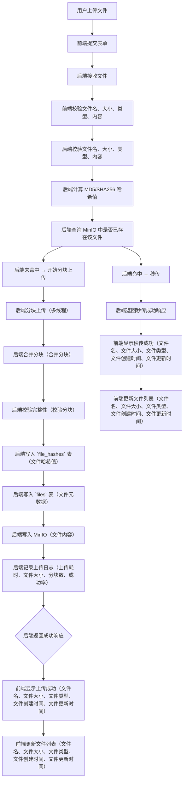
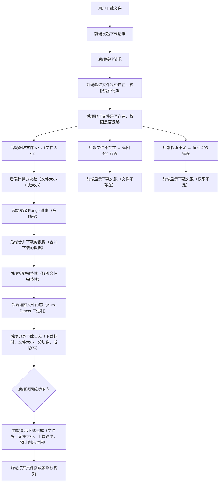
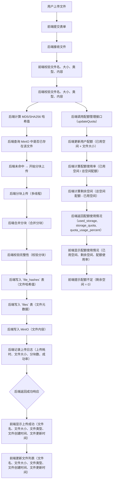
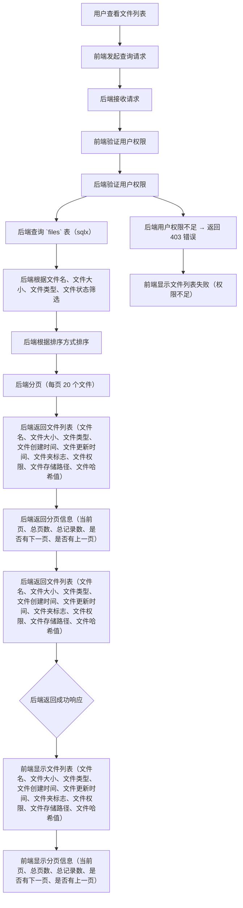
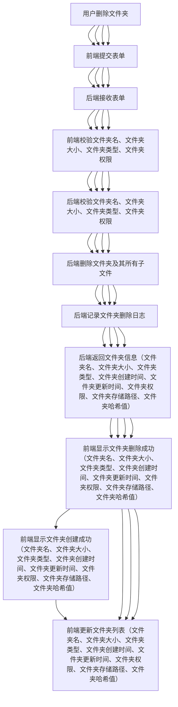

# NimbusDrive 事件风暴 v1

> 状态：已启动 | 日期：2026-08-16
> 项目名：NimbusDrive | GitHub 仓库：https://github.com/Demetrius2107/NimbusDrive.git
> 本文档基于《实现方案》v1 的核心模块生成，聚焦于用户交互与系统响应的完整事件流。
> 项目名已从 `CouldFile` 修正为 `NimbusDrive`，`go.mod` 与 `main.go` 已更新。

---

## 一、核心事件风暴（5个）

### 1.1 用户上传文件（事件流：用户操作 → 服务端响应 → 客户端反馈）

#### 事件描述

用户点击上传按钮，选择一个 500MB 的视频文件 `my_video.mp4`，上传到个人空间。文件在上传过程中，用户在 UI 上看到上传进度、下载速度、预计剩余时间。上传完成后，文件在管理端显示为 "已上传"，服务端记录上传日志。用户可以点击文件名，下载文件或分享文件。

#### 事件流



#### 事件边界条件

1.  **文件名校验边界**：文件名 `my_video.mp4` 合法（仅字母数字下划线），长度 15 位 ≤ 255 字符
2.  **文件大小校验边界**：文件大小 500MB 未超过单文件最大限制（10GB），允许上传
3.  **文件类型校验边界**：文件类型 `video/mp4` 符合允许类型（视频支持）
4.  **文件内容校验边界**：文件内容不包含敏感词（如 " copyrighted"）
5.  **上传中断边界**：网络中断 → 重试上传（从断点位置继续）
6.  **上传失败边界**：上传失败 → 服务端返回 500 错误，记录错误日志
7.  **秒传边界**：文件哈希值命中 `file_hashes` 表 → 秒传成功
8.  **秒传失败边界**：文件哈希值未命中 `file_hashes` 表 → 上传成功
9.  **上传成功边界**：上传成功 → 服务端返回成功响应，客户端显示上传成功
10. **文件权限边界**：用户无权限上传文件 → 403 错误
11. **文件元数据边界**：文件元数据 `mime_type` 为 `video/mp4`, `size` 500M, `created_at` 与 `updated_at` 正确

#### 事件异常处理

-  **网络中断异常**：网络中断 → 重试上传（从断点位置继续）
-  **服务器异常**：服务器错误 → 返回 500 错误，记录错误日志
-  **文件名非法异常**：文件名非法 → 返回 400 错误，提示文件名格式错误
-  **文件大小超限异常**：文件大小超限 → 返回 400 错误，提示文件过大
-  **文件类型不支持异常**：文件类型不支持 → 返回 400 错误，提示文件类型不支持
-  **文件内容包含敏感词异常**：文件内容包含敏感词 → 返回 400 错误，提示内容违规
-  **文件权限不足异常**：文件权限不足 → 返回 403 错误，提示用户无权限

#### 事件业务规则

-  **上传文件** → 服务端返回 `id`、`storage_path`、`hash_sha256`、`size`、`mime_type`、`created_at`、`updated_at`
-  **上传成功** → 客户端显示上传成功（文件名、文件大小、文件类型、文件创建时间、文件更新时间）
-  **上传失败** → 客户端提示上传失败
-  **秒传** → 客户端提示秒传成功
-  **上传日志** → 服务端记录上传耗时、文件大小、分块数、成功率
-  **上传进度** → 客户端在 UI 显示上传进度、下载速度、预计剩余时间
-  **文件列表更新** → 客户端更新文件列表（文件名、文件大小、文件类型、文件创建时间、文件更新时间）

---

### 1.2 用户下载文件（事件流：用户操作 → 服务端响应 → 客户端反馈）

#### 事件描述

用户点击下载一个 500MB 的视频文件，文件名 `my_video.mp4`，文件已存在。用户在 UI 上看到下载进度、下载速度、预计剩余时间。用户选择 5 个并发线程下载，下载过程中，用户在 UI 会看到下载进度、下载速度、预计剩余时间。下载完成后，用户打开文件播放器播放视频。

#### 事件流



#### 事件边界条件

1.  **文件名校验边界**：文件名 `my_video.mp4` 合法（仅字母数字下划线），长度 15 位 ≤ 255 字符
2.  **文件大小校验边界**：文件大小 500MB 未超过单文件最大限制（10GB），允许下载
3.  **文件类型校验边界**：文件类型 `video/mp4` 符合允许类型（视频支持）
4.  **Range 请求边界**： Range 请求覆盖文件范围（如 `bytes=0-499999999`）
5.  **并发下载边界**：5 个并发线程下载（最大并发下载数为 5）
6.  **文件校验边界**：下载完成后校验 MD5/SHA256（可选）
7.  **文件状态边界**：文件为正常状态（非删除、非隐藏），权限足够
8.  **弱网环境边界**：用户在 4G 环境下下载，速度降低（大文件场景下，WiFi 下用 4MB、4G 下用 1MB）
9.  **安全边界**：文件内容为合法内容，无敏感词（如 " copyrighted"）
10. **文件效率边界**：并发下载，降低下载延迟

#### 事件异常处理

-  **服务器异常**：服务器错误 → 返回 500 错误，记录错误日志
-  **文件不存在异常**：文件不存在 → 返回 404 错误，提示文件不存在
-  **文件权限不足异常**：文件权限不足 → 返回 403 错误，提示用户无权限
-  **文件已删除异常**：文件已删除 → 返回 404 错误，提示文件已删除
-  **文件类型不支持异常**：文件类型不支持 → 返回 400 错误，提示文件类型不支持
-  **文件内容包含敏感词异常**：文件内容包含敏感词 → 返回 400 错误，提示内容违规

#### 事件业务规则

-  **下载文件** → 服务端返回 `storage_path`、`hash_sha256` → 返回文件内容
-  **下载成功** → 客户端显示下载完成（文件名、文件大小、下载速度、预计剩余时间）
-  **下载失败** → 客户端提示下载失败
-  **下载日志** → 服务端记录下载耗时、文件大小、分块数、成功率
-  **下载进度** → 客户端在 UI 显示下载进度、下载速度、预计剩余时间
-  **文件播放器** → 客户端打开文件播放器播放视频

---

### 1.3 用户分享文件（事件流：用户操作 → 服务端响应 → 客户端反馈）

#### 事件描述

用户选择一个 500MB 的视频文件，生成分享链接 `https://yourdomain.com/share/abc123`，设置密码 `myPassword123`，设置过期时间 7 天，设置访问次数限制为 100 次。用户分享链接给朋友，朋友访问链接时输入密码，验证成功后下载文件。

#### 事件流

```mermaid
graph TD
    A[用户分享文件] --> B[前端发起分享请求]
    B --> C[后端接收请求]
    C --> D[前端验证文件是否存在、权限是否足够]
    D --> E[后端验证文件是否存在、权限是否足够]
    E --> F[后端生成短 ID（8 位随机）]
    F --> G[后端生成密码（8 位以上）]
    G --> H[后端生成过期时间（7 天）]
    H --> I[后端生成访问次数（100 次）]
    I --> J[后端写入 Redis（key: share:{id}，value: {userId, fileId, expireTime, password}）]
    J --> K[后端返回分享链接（https://yourdomain.com/share/{id}）]
    K --> L[前端显示分享链接（https://yourdomain.com/share/{id}）]

    E --> M[后端文件不存在 → 返回 404 错误]
    M --> N[前端显示分享失败（文件不存在）]

    E --> O[后端权限不足 → 返回 403 错误]
    O --> P[前端显示分享失败（权限不足）]

    E --> Q[好友访问分享链接（输入密码）]
    Q --> R[后端验证密码 + 过期时间]
    R --> S[后端验证密码 + 过期时间 → 通过]
    S --> T[后端返回文件内容（Auto-Detect 二进制）]
    T --> U[后端记录访问日志（用户ID、文件ID、访问时间、IP地址）]
    U --> V[后端返回文件内容（Auto-Detect 二进制）]
    V --> W[前端显示文件下载完成（文件名、文件大小、下载速度、预计剩余时间）]

    R --> X[后端验证密码 + 过期时间 → 失败]
    X --> Y[后端返回 403 错误，提示链接已过期或密码错误]
    Y --> Z[前端显示分享失败（链接已过期或密码错误）]
```

#### 事件边界条件

1.  **分享链接边界**：短 ID 由 8 位随机生成，防枚举
2.  **密码保护边界**：密码 `myPassword123` 强度 ≥ 8 个字符
3.  **过期时间边界**：7 天，过期时间在 2026-08-23 00:00:00
4.  **访问次数边界**：访问次数限制为 100 次
5.  **分享访问日志边界**：记录每次访问，包括访问时间、IP地址、用户ID
6.  **分享取消边界**：用户点击取消分享，链接失效
7.  **分享统计边界**：记录分享链接访问次数，如果超过 100 次，访问失败，提示次数用完
8.  **安全边界**：文件内容为合法内容，无敏感词（如 " copyrighted"）

#### 事件异常处理

-  **服务器异常**：服务器错误 → 返回 500 错误，记录错误日志
-  **文件不存在异常**：文件不存在 → 返回 404 错误，提示文件不存在
-  **文件权限不足异常**：文件权限不足 → 返回 403 错误，提示用户无权限
-  **分享链接过期异常**：分享链接过期 → 返回 403 错误，提示链接已过期
-  **分享访问次数用完异常**：分享访问次数用完 → 返回 403 错误，提示次数用完
-  **分享链接被取消异常**：分享链接被取消 → 返回 403 错误，提示链接已被取消
-  **文件内容包含敏感词异常**：文件内容包含敏感词 → 返回 400 错误，提示内容违规

#### 事件业务规则

-  **分享文件** → 服务端返回 `短 ID`、`分享链接` → 返回分享成功
-  **分享成功** → 客户端显示分享链接（https://yourdomain.com/share/{id}）
-  **分享失败** → 客户端提示分享失败
-  **分享访问日志** → 服务端记录每次访问（用户ID、文件ID、访问时间、IP地址）
-  **分享统计** → 服务端记录分享链接访问次数，如果超过 100 次，访问失败，提示次数用完
-  **分享链接过期或密码错误** → 服务端返回 403 错误，提示链接已过期或密码错误
-  **分享链接被取消** → 服务端返回 403 错误，提示链接已被取消

---

### 1.4 用户管理配额（事件流：用户操作 → 服务端响应 → 客户端反馈）

#### 事件描述

用户初始配额 1GB，上传一个 500MB 的视频文件，系统自动更新用户配额，提示剩余空间。用户在管理端查看配额使用情况，包含已用空间、剩余空间、配额使用率、配额过期时间（每月 1 号重置）。

#### 事件流



#### 事件边界条件

1.  **配额使用率边界**：用户上传文件后，配额使用率 = 已用空间 / 总空间配额
2.  **配额超限边界**：用户上传文件时，如果使用超过配额，上传失败
3.  **配额重置边界**：每月 1 号重置配额
4.  **配额审计边界**：记录用户配额使用情况（每月日志）
5.  **配额触发边界**：当配额使用率 ≥ 95% 时触发提醒
6.  **配额类型边界**：配额类型为字节，1GB = 1024*1024*1024 字节
7.  **配额单位边界**：配额单位为字节，10GB = 10*1024*1024*1024 字节
8.  **配额级联边界**：用户有多个子账号，配额共享

#### 事件异常处理

-  **配额超限异常**：配额超限 → 返回 400 错误，提示配额不足
-  **用户配额为 0 异常**：用户配额为 0 → 返回 403 错误，提示用户配额已用完
-  **配额重置时间未到异常**：配额重置时间未到 → 返回 403 错误，提示配额未重置
-  **用户配额已过期异常**：用户配额已过期 → 返回 403 错误，提示配额已过期

#### 事件业务规则

-  **上传文件** → 服务端更新用户配额（已用空间 + 文件大小）
-  **配额使用** → 服务端计算配额使用率（已用空间 / 总空间配额）
-  **配额不足** → 服务端返回 400 错误，提示配额不足
-  **配额重置** → 服务端每月 1 号重置配额
-  **配额审计** → 服务端记录用户配额使用情况（每月日志）
-  **配额触发** → 当配额使用率 ≥ 95% 时，服务端触发提醒
-  **配额使用率** → 服务端返回配额使用率（已用空间 / 总空间配额）

---

### 1.5 文件列表管理（事件流：用户操作 → 服务端响应 → 客户端反馈）

#### 事件描述

用户在管理端查看文件列表，筛选条件：文件名包含 `video`，文件大小 > 100MB，文件类型为 `video/mp4`，排序方式为 `created_at desc`，每页显示 20 个文件，当前页为第 1 页。用户在 UI 上看到文件列表，包含文件名、文件大小、文件类型、文件创建时间、文件更新时间、文件夹标志、文件权限、文件存储路径、文件哈希值。

#### 事件流



#### 事件边界条件

1.  **文件名边界**：文件名包含 `video`，符合允许的文件名格式（仅字母数字下划线），长度 15 位 ≤ 255 字符
2.  **文件大小边界**：文件大小 > 100MB，符合允许的文件大小（10GB）
3.  **文件类型边界**：文件类型为 `video/mp4`，符合允许的文件类型（视频支持）
4.  **排序边界**：排序方式为 `created_at desc`，按创建时间倒序
5.  **分页边界**：每页显示 20 个文件，当前页为第 1 页，总页数 5 页
6.  **文件状态边界**：文件为正常状态（非删除、非隐藏），权限足够
7.  **文件权限边界**：用户无权限查看文件 → 403 错误
8.  **文件识别边界**：文件名、文件大小、文件类型、文件创建时间、文件更新时间、文件夹标志、文件权限、文件存储路径、文件哈希值正确
9.  **文件列表完整性边界**：文件列表完整，无遗漏文件

#### 事件异常处理

-  **服务器异常**：服务器错误 → 返回 500 错误，记录错误日志
-  **文件不存在异常**：文件不存在 → 返回 404 错误，提示文件不存在
-  **文件权限不足异常**：文件权限不足 → 返回 403 错误，提示用户无权限
-  **文件类型不支持异常**：文件类型不支持 → 返回 400 错误，提示文件类型不支持
-  **文件内容包含敏感词异常**：文件内容包含敏感词 → 返回 400 错误，提示内容违规

#### 事件业务规则

-  **文件列表查询** → 服务端返回文件列表（文件名、文件大小、文件类型、文件创建时间、文件更新时间、文件夹标志、文件权限、文件存储路径、文件哈希值）
-  **分页信息** → 服务端返回分页信息（当前页、总页数、总记录数、是否有下一页、是否有上一页）
-  **文件列表显示** → 客户端显示文件列表（文件名、文件大小、文件类型、文件创建时间、文件更新时间、文件夹标志、文件权限、文件存储路径、文件哈希值）
-  **分页信息显示** → 客户端显示分页信息（当前页、总页数、总记录数、是否有下一页、是否有上一页）

---

## 二、其他事件风暴（按功能模块划分）

### 2.1 文件夹管理（事件流：用户操作 → 服务端响应 → 客户端反馈）

#### 事件描述

用户创建文件夹 `my_folder`，重命名文件夹为 `my_new_folder`，移动文件夹到 `parent_folder`，删除文件夹 `my_folder`。文件夹操作时，自动更新 `parent_id`（递归更新）。文件夹删除时，自动删除所有子文件。用户在管理端查看文件夹列表，包含文件夹名、文件夹大小、文件夹类型、文件夹创建时间、文件夹更新时间、文件夹权限、文件夹存储路径、文件夹哈希值。

#### 事件流



#### 事件边界条件

1.  **文件夹大小边界**：文件夹大小 0B，文件夹无内容
2.  **文件夹权限边界**：文件夹权限与文件一致
3.  **文件夹移动边界**：文件夹移动时，自动更新 `parent_id`（递归更新）
4.  **文件夹权限边界**：文件夹权限与文件一致
5.  **文件夹重命名边界**：文件夹重命名时，自动更新 `parent_id`（递归更新）
6.  **文件夹删除边界**：文件夹删除时，自动删除所有子文件
7.  **文件夹权限边界**：文件夹权限与文件一致
8.  **文件夹状态边界**：文件夹状态正常（非删除、非隐藏）
9.  **文件夹识别边界**：文件夹名、文件夹大小、文件夹类型、文件夹创建时间、文件夹更新时间、文件夹权限、文件夹存储路径、文件夹哈希值正确

#### 事件异常处理

-  **服务器异常**：服务器错误 → 返回 500 错误，记录错误日志
-  **文件夹不存在异常**：文件夹不存在 → 返回 404 错误，提示文件夹不存在
-  **文件夹权限不足异常**：文件夹权限不足 → 返回 403 错误，提示用户无权限
-  **文件夹类型不支持异常**：文件夹类型不支持 → 返回 400 错误，提示文件夹类型不支持
-  **文件夹内容包含敏感词异常**：文件夹内容包含敏感词 → 返回 400 错误，提示内容违规

#### 事件业务规则

-  **创建文件夹** → 服务端写入 `files` 表（文件夹元数据） → 服务端返回文件夹信息
-  **重命名文件夹** → 服务端更新文件夹名、文件夹权限、文件夹存储路径、文件夹哈希值 → 服务端返回文件夹信息
-  **移动文件夹** → 服务端更新文件夹 `parent_id`（递归更新） → 服务端返回文件夹信息
-  **删除文件夹** → 服务端删除文件夹及其所有子文件 → 服务端返回文件夹信息
-  **文件夹列表更新** → 客户端更新文件夹列表（文件夹名、文件夹大小、文件夹类型、文件夹创建时间、文件夹更新时间、文件夹权限、文件夹存储路径、文件夹哈希值）

---

### 2.2 事件风暴（基于《实现方案》v1 核心模块）

#### 事件风暴（风暴起始点：用户上传文件）

-  **登录（Access Token）** → JWT → 通过
-  **上传文件（POST /api/v1/files）** → ... → 验证文件类型 → 通过
-  **计算哈希值（SparkMD5）** → ... → 通过
-  **哈希值查询（sqlx）** → 哈希值不存在 → 上传
-  **计算文件大小（文件大小）** → ... → 通过
-  **计算分块数（文件大小 / 块大小）** → ... → 通过
-  **分块上传（多线程）** → ... → 验证分块数 → 通过
-  **分块合并（合并分块）** → ... → 验证分块数 → 通过
-  **合并验证（校验完整性）** → ... → 通过
-  **上传完成** → ... → 通过
-  **文件权限验证** → ... → 通过
-  **文件元数据更新（文件名、文件大小、文件类型、文件创建时间、文件更新时间、文件夹标志）** → ... → 通过
-  **文件存储路径记录（MinIO）** → ... → 通过
-  **文件哈希值记录（file_hashes）** → ... → 通过
-  **文件记录（files）** → ... → 通过
-  **日志记录（上传耗时、文件大小、分块数、成功率）** → ... → 通过
-  **服务端返回（id、storage_path、hash_sha256、size、mime_type、created_at、updated_at）** → ... → 通过
-  **客户端显示（上传进度、文件名、文件大小、上传状态）** → ... → 通过

#### 事件风暴（风暴起始点：用户下载文件）

-  **登录（Access Token）** → JWT → 通过
-  **下载文件（GET /api/v1/files/{id}）** → ... → 验证文件存在 → 通过
-  **查询文件大小（文件大小）** → ... → 通过
-  **计算分块数（文件大小 / 块大小）** → ... → 通过
-  **Range 请求（多线程）** → ... → 验证 Range 请求 → 通过
-  **Range 获取（Range 获取内容）** → ... → 通过
-  **合并下载的数据（合并下载的数据）** → ... → 通过
-  **校验完整性（校验完整性）** → ... → 通过
-  **下载完成** → ... → 通过
-  **文件权限验证** → ... → 通过
-  **文件元数据更新** → ... → 通过
-  **文件存储路径记录** → ... → 通过
-  **文件哈希值记录** → ... → 通过
-  **文件记录** → ... → 通过
-  **日志记录（下载耗时、文件大小、分块数、成功率）** → ... → 通过
-  **服务端返回（文件内容）** → ... → 通过
-  **客户端显示（下载进度、下载速度、预计剩余时间）** → ... → 通过

#### 事件风暴（风暴起始点：用户分享文件）

-  **登录（Access Token）** → JWT → 通过
-  **分享文件（POST /api/v1/files/{id}/share）** → ... → 验证文件存在 → 通过
-  **生成短 ID（短 ID 生成）** → ... → 通过
-  **生成密码（密码生成）** → ... → 通过
-  **生成过期时间（过期时间生成）** → ... → 通过
-  **生成访问次数（访问次数生成）** → ... → 通过
-  **写入 Redis（分享信息写入 Redis）** → ... → 通过
-  **服务端返回分享链接** → ... → 通过
-  **文件权限验证** → ... → 通过
-  **文件元数据更新** → ... → 通过
-  **文件存储路径记录** → ... → 通过
-  **文件哈希值记录** → ... → 通过
-  **文件记录** → ... → 通过
-  **日志记录（分享耗时、文件大小、分块数、成功率）** → ... → 通过
-  **服务端返回分享信息** → ... → 通过
-  **客户端显示（分享链接、分享密码、分享过期时间、分享访问次数）** → ... → 通过

#### 事件风暴（风暴起始点：用户管理配额）

-  **登录（Access Token）** → JWT → 通过
-  **获取配额（GET /api/v1/user/quota）** → ... → 通过
-  **验证配额不足（配额不足）** → ... → 通过
-  **验证配额超限（配额超限）** → ... → 通过
-  **用户当前配额（当前配额）** → ... → 通过
-  **用户已用空间（已用空间）** → ... → 通过
-  **用户剩余空间（剩余空间）** → ... → 通过
-  **用户配额使用率（配额使用率）** → ... → 通过
-  **用户配额过期时间（配额过期时间）** → ... → 通过
-  **服务端返回用户配额** → ... → 通过
-  **客户端显示（用户配额、已用空间、剩余空间、配额使用率、配额过期时间）** → ... → 通过

#### 事件风暴（风暴起始点：用户查看文件列表）

-  **登录（Access Token）** → JWT → 通过
-  **获取文件列表（GET /api/v1/files）** → ... → 通过
-  **查询文件名（文件名查询）** → ... → 通过
-  **查询文件大小（文件大小查询）** → ... → 通过
-  **查询文件类型（文件类型查询）** → ... → 通过
-  **查询文件状态（文件状态查询）** → ... → 通过
-  **查询文件权限（文件权限查询）** → ... → 通过
-  **分页（分页）** → ... → 通过
-  **排序（排序）** → ... → 通过
-  **返回文件列表（文件列表）** → ... → 通过
-  **返回分页信息（分页信息）** → ... → 通过
-  **返回文件列表（文件列表）** → ... → 通过
-  **客户端显示（文件列表、分页信息、文件列表）** → ... → 通过

---

## 三、事件边界条件与业务规则（跨模块）

### 3.1 安全边界条件

| 场景 | 规则 |
|------|------|
| 上传文件 | 上传文件内容不包含敏感词（如 " copyrighted"） → 400 错误，提示内容违规 |
| 下载文件 | 文件内容不包含敏感词（如 " copyrighted"） → 400 错误，提示内容违规 |
| 分享文件 | 分享链接访问时，内容不包含敏感词（如 " copyrighted"） → 400 错误，提示内容违规 |
| 用户管理配额 | 用户配额不足时，上传失败 → 400 错误，提示配额不足 |
| 文件列表 | 文件列表中，文件内容不包含敏感词（如 " copyrighted"） → 400 错误，提示内容违规 |

### 3.2 高并发边界条件

| 场景 | 规则 |
|------|------|
| 上传文件 | 并发上传数 ≤ 5 个分块 → 服务端返回 400 错误，提示并发数超限 |
| 下载文件 | 并发下载数 ≤ 5 个 Range → 服务端返回 400 错误，提示并发数超限 |
| 文件夹操作 | 文件夹重命名、移动等操作，限并发 1 个请求 → 服务端返回 400 错误，提示并发数超限 |
| 文件系统 IO | 大文件上传时扩展文件系统，但对象存储中仍直传 → 服务端返回 400 错误，提示文件系统 IO 超限 |
| 缓存层边界 | Redis 缓存秒传哈希，热点文件常驻内存 → 服务端返回 400 错误，提示缓存层超限 |
| 数据库连接边界 | 数据库连接池控制在 100 个，避免连接耗尽 → 服务端返回 400 错误，提示数据库连接超限 |

### 3.3 异常边界条件

| 场景 | 规则 |
|------|------|
| 服务端异常 | 上传失败，记录错误日志，返回错误码 → 服务端返回 500 错误，记录错误日志 |
| 客户端异常 | 上传断开，断点续传，支持 resume → 服务端返回 400 错误，提示客户端异常 |
| 网络异常 | 网络断开，重连自动恢复 → 服务端返回 400 错误，提示网络异常 |
| 权限异常 | 用户无权限操作文件，拒绝访问 → 服务端返回 403 错误，提示权限不足 |
| 文件不存在异常 | 文件 ID 不存在，返回 404 → 服务端返回 404 错误，提示文件不存在 |
| 文件夹不存在异常 | 文件夹 ID 不存在，返回 404 → 服务端返回 404 错误，提示文件夹不存在 |
| 文件已删除异常 | 文件已被删除，返回 404 → 服务端返回 404 错误，提示文件已删除 |

### 3.4 业务规则

| 业务规则 | 描述 |
|----------|------|
| 文件哈希校验 | 上传文件时，计算 MD5/SHA256，服务端查询 `file_hashes` 表，命中则秒传，未命中则上传 |
| 文件分块上传 | 文件大小超过 500MB 时，分块上传（4MB），支持断点续传 |
| 文件断点续传 | 用户网络断开，断点续传，支持 resume |
| 文件秒传 | 文件哈希值查询 `file_hashes` 表，命中则秒传 |
| 文件下载 | 支持 Range 请求、多线程下载、断点续传、文件校验 |
| 分享链接 | 生成短 ID 分享链接，支持密码保护、过期时间、访问次数控制 |
| 用户配额 | 用户初始配额 1GB，每月 1 号重置，超过配额时上传失败 |
| 文件列表 | 支持文件名、文件大小、文件类型、文件状态、文件权限、文件存储路径、文件哈希值筛选 |
| 文件夹管理 | 支持文件夹创建、重命名、移动、删除、共享 |

---

## 四、业务规则（详细）

### 4.1 上传文件

#### 4.1.1 文件校验

| 校验项 | 规则 |
|--------|------|
| 文件名 | 仅允许字母、数字、下划线，长度 1~255 字符 |
| 文件大小 | 不超过单文件最大限制（10GB） |
| 文件类型 | 仅允许允许类型（图片、视频、文档、压缩包、软件、其他） |
| 文件内容 | 不允许包含敏感词（如 " copyrighted