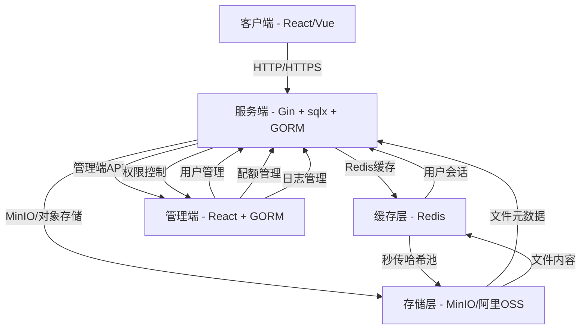
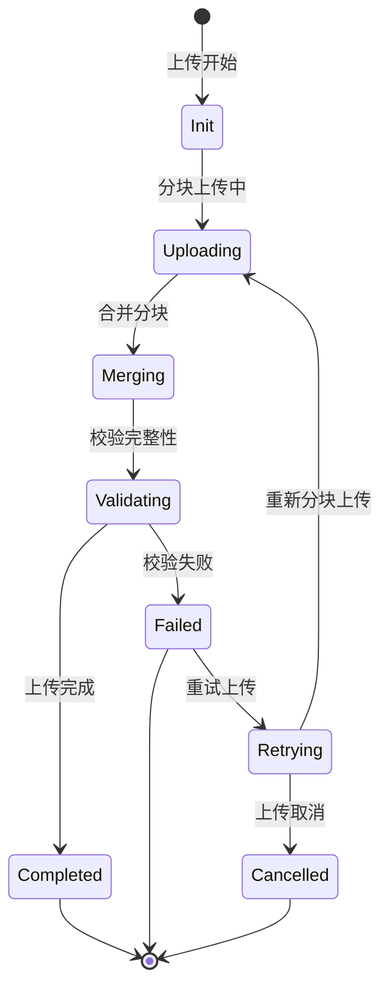
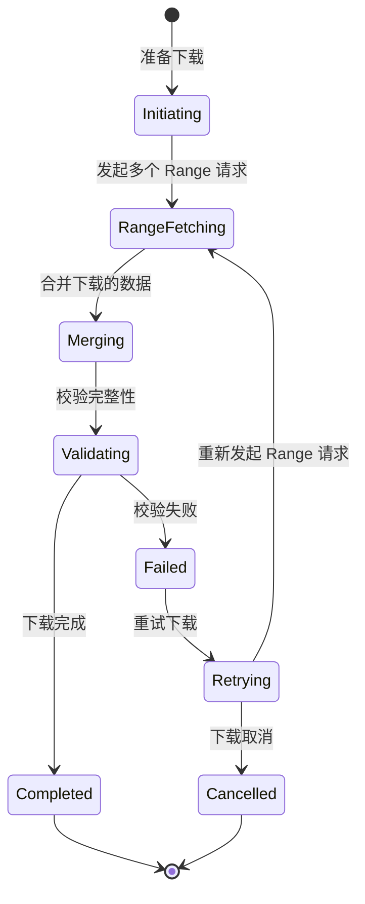
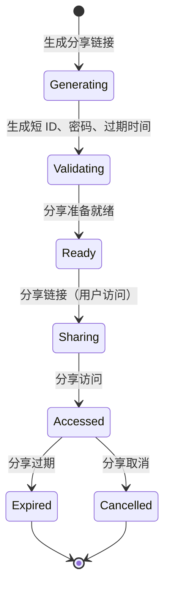

# NimbusDrive 实现方案 v1

> 状态：已启动 | 日期：2026-08-16
> 用途：指导开发、设计文档、接口文档、事件风暴，避免 CRUD。
> 项目名：NimbusDrive | 模块名：NimbusDrive | GitHub 仓库：https://github.com/Demetrius2107/NimbusDrive.git

---

## 一、系统架构图（模块划分、数据流、部署拓扑）

### 1.1 模块划分（三层架构）



### 1.2 数据流（核心业务）

#### 上传流程（客户端 → 服务端 → 存储）

1. 客户端计算文件 MD5/SHA256（SparkMD5，Web Worker）
2. 服务端查询 `file_hashes` 表（sqlx）
   - 命中 → 返回`storage_path` → `秒传` → 直接写入对象存储（MinIO）、更新状态 + 返回已存在
   - 未命中 → 分块上传（4MB）、生成 `chunk_count`、记录到 `files` 表
3. 服务端 `files` 表：存储文件名、大小、类型、文件夹、哈希、chunk_count、状态
4. 服务端 `file_hashes` 表：存储 `hash_sha256` → `storage_path`（全局去重）、`ref_count`
5. 服务端 `storage_path` → MinIO 的实际存储路径（S3 兼容）
6. 服务端写入 `files` 表 + `file_hashes` 表 + `storage` 表，同时记录 `chunk_count`（分块数）
7. 服务端返回 `文件ID`、`storage_path`、`hash_sha256` 给客户端

#### 下载流程（客户端 → 服务端 → 存储）

1. 客户端请求 `/api/v1/files/{id}`
2. 服务端查询 `files` 表（sqlx）
3. 服务端返回 `storage_path`（从 `file_hashes` 表），若为秒传文件，直接返回 `storage_path` → MinIO
4. 客户端发起 Range 请求（HTTP/Range），多线程下载不同段
5. 服务端`Range` 与 MinIO `object.get` 交互（直传）
6. 服务端记录每个 Range 的下载次数（TBD）
7. 服务端返回文件内容

#### 分享流程（客户端 → 服务端 → 缓存）

1. 客户端生成短 ID + 密码 + 过期时间
2. 服务端将分享信息写入 Redis（key: `share:{id}`，value: `{userId, fileId, expireTime, password}`）
3. 服务端返回短 ID 给客户端
4. 客户端生成分享链接：`https://yourdomain.com/share/{id}`
5. 服务端验证密码 + 过期时间，返回文件内容（Auto-Detect 二进制）
6. 服务端记录每次访问（TBD）

#### 管理端流程（管理端 → 服务端 → 数据库）

1. 管理端发起 API 请求（如 GET /api/v1/users）
2. 服务端查询 `users` 表（GORM），返回用户列表
3. 服务端返回用户信息（包含配额已用、文件夹数、活跃度）
4. 服务5. 服务端 `users` 表：`id, username, email, password_hash, storage_quota, used_storage, created_at`
   - `storage_quota`: 总空间配额
   - `used_storage`: 已用空间
   - `created_at`: 创建时间
   - `quota_usage_percent`: 已用百分比 = used_storage / storage_quota
6. 服务端 `files` 表：`id, user_id, parent_id, name, size, mime_type, storage_path, hash_md5, hash_sha256, chunk_count, is_folder, created_at, updated_at`
   - `user_id`: 所属用户
   - `parent_id`: 父文件夹（递归树）
   - `name`: 文件名
   - `size`: 文件大小
   - `mime_type`: MIME 类型
   - `storage_path`: 对象存储路径
   - `hash_md5/sha256`: 用于秒传、校验
   - `chunk_count`: 分块数量
   - `is_folder`: 文件夹标志
   - `created_at`: 创建时间
   - `updated_at`: 更新时间
7. 服务端 `file_hashes` 表：`hash_sha256 PRIMARY KEY, storage_path, ref_count, size`
   - `ref_count`: 引用计数（多少个用户拥有该文件）
   - `size`: 原始文件大小

### 1.3 部署拓扑

#### 服务端
- **语言/框架**：Go + Gin（v1.0）
- **数据库驱动**：sqlx + pgx（raw SQL 手写）
  - `files` 表：分块上传、秒传查询、递归 CTE 目录树
  - `file_hashes` 表：全局去重、引用计数
- **缓存**：Redis 7（秒传缓存、会话、限流、分享缓存）
- **存储**：MinIO（自托管）/ 阿里OSS（备选）
  - `S3 API` 兼容，直传优化（避免服务端中转）
- **安全**：JWT 认证 + SQL 校验 + 反序列化过滤
- **监控**：zap 日志 + Prometheus + Grafana（后续）

#### 客户端
- **前端框架**：React 18 + TS + Vite
- **UI 组件库**：Ant Design 5
  - Tree/Upload/Table/Progress 组件全用
- **上传模块**：自研分块上传（原生 XHR + Web Worker + spark-md5）
- **状态管理**：Zustand
- **网络请求**：Axios + 非阻塞加载，响应统一格式
- **路由**：React Router v7
- **图表**：ECharts（空间/流量可视化）

#### 管理端
- **前端框架**：React 18 + TS + Vite（与客户端复用）
- **UI 组件库**：Ant Design 5
- **后端 API**：GORM（CRUD 专用，减少 sqlx 复杂度）
  - `users` 表：用户管理
  - `files` 表：文件管理
  - `file_hashes` 表：哈希池管理
  - `logs` 表（TBD）

#### 扩展/后期
- **移动端**：React Native (Expo) —— 与 React 前端技能复用最大化
- **云基础设施**：CDN（全球加速）、K8s（后期）、对象存储（须全局 S3 配置）

---

## 二、核心模块设计（上传/下载/分享/管理）

### 2.1 上传模块

#### 2.1.1 功能描述

- 支持大文件分块上传（4MB）
- 支持断点续传
- 支持秒传（文件哈希查重）
- 支持多线程上传（并发数可控）
- 支持文件夹管理（递归目录结构）
- 支持文件重命名、移动
- 支持文件权限管理（TBD）

#### 2.1.2 核心业务流程

1. 客户端计算 MD5/SHA256（Web Worker）
2. 服务端查询哈希池（sqlx）
   - 命中 → `秒传` → 直接写入对象存储（MinIO），返回已存在
   - 未命中 → 分块上传（4MB），生成 `chunk_count`，记录到 `files` 表
3. 服务端 `files` 表：存储文件名、大小、类型、文件夹、哈希、chunk_count、状态
4. 服务端 `file_hashes` 表：存储 `hash_sha256` → `storage_path`（全局去重）、`ref_count`
5. 服务端 `storage_path` → MinIO 的实际存储路径（S3 兼容）
6. 服务端写入 `files` 表 + `file_hashes` 表 + `storage` 表，同时记录 `chunk_count`
7. 服务端返回 `文件ID`、`storage_path`、`hash_sha256` 给客户端

#### 2.1.3 数据结构（设计时）

```go
// files 表
// id: 文件ID
// user_id: 所属用户ID
// parent_id: 父文件夹ID（递归树）
// name: 文件名
// size: 文件大小
// mime_type: MIME 类型
// storage_path: 对象存储路径
// hash_md5: MD5 哈希
// hash_sha256: SHA256 哈希
// chunk_count: 分块数量
// is_folder: 文件夹标志
// created_at: 创建时间
// updated_at: 更新时间

// file_hashes 表
// hash_sha256: 哈希值（主键）
// storage_path: 实际存储路径
// ref_count: 引用计数
// size: 原始文件大小
```

### 2.2 下载模块

#### 2.2.1 功能描述

- 支持 Range 请求（HTTP/Range）
- 支持多线程下载（并发数可控）
- 支持断点续传（记录下载进度）
- 支持文件校验（MD5/SHA256）
- 支持文件夹管理（递归目录结构）
- 支持文件重命名、移动（TBD）
- 支持文件权限管理（TBD）

#### 2.2.2 核心业务流程

1. 客户端请求 `/api/v1/files/{id}`
2. 服务端查询 `files` 表（sqlx）
3. 服务端返回 `storage_path`（从 `file_hashes` 表），若为秒传文件，直接返回 `storage_path` → MinIO
4. 客户端发起 Range 请求（HTTP/Range），多线程下载不同段
5. 服务端`Range` 与 MinIO `object.get` 交互（直传）
6. 服务端记录每个 Range 的下载次数（TBD）
7. 服务端返回文件内容

#### 2.2.3 数据结构（设计时）

```go
// files 表
// id: 文件ID
// user_id: 所属用户ID
// parent_id: 父文件夹ID（递归树）
// name: 文件名
// size: 文件大小
// mime_type: MIME 类型
// storage_path: 对象存储路径
// hash_md5: MD5 哈希
// hash_sha256: SHA256 哈希
// chunk_count: 分块数量
// is_folder: 文件夹标志
// created_at: 创建时间
// updated_at: 更新时间
```

### 2.3 分享模块

#### 2.3.1 功能描述

- 支持生成短ID分享链接
- 支持密码保护
- 支持过期时间控制
- 支持访问次数控制
- 支持分享统计（TBD）
- 支持分享访问日志（TBD）

#### 2.3.2 核心业务流程

1. 客户端生成短 ID + 密码 + 过期时间
2. 服务端将分享信息写入 Redis（key: `share:{id}`，value: `{userId, fileId, expireTime, password}`）
3. 服务端返回短 ID 给客户端
4. 客户端生成分享链接：`https://yourdomain.com/share/{id}`
5. 服务端验证密码 + 过期时间，返回文件内容（Auto-Detect 二进制）
6. 服务端记录每次访问（TBD）

#### 2.3.3 数据结构（设计时）

```go
// share 表（Redis 哈希，非数据库表）
// key: `share:{id}`
// fields: userId, fileId, expireTime, password, accessCount, lastAccessTime

// 服务端 Redis 哈希（canonical hash）
// share:{id}:userId
// share:{id}:fileId
// share:{id}:expireTime
// share:{id}:password
// share:{id}:accessCount
// share:{id}:lastAccessTime
```

### 2.4 管理端模块

#### 2.4.1 功能描述

- 支持用户管理（CRUD，GORM）
- 支持配额管理（查看/修改）
- 支持文件管理（查看/删除/移动）
- 支持日志管理（TBD）
- 支持分享统计（TBD）
- 支持权限管理（TBD）

#### 2.4.2 核心业务流程

1. 管理端发起 API 请求（如 GET /api/v1/users）
2. 服务端查询 `users` 表（GORM），返回用户列表
3. 服务端返回用户信息（包含配额已用、文件夹数、活跃度）
4. 管理端查看用户信息（用户名、邮箱、配额、已用空间、注册时间、活跃度）
5. 管理端发起 API 请求（如 DELETE /api/v1/users/{id}）
6. 服务端删除 `users` 表记录
7. 服务端删除 `files` 表中该用户的所有文件记录
8. 服务端删除 `file_hashes` 表中该用户的所有哈希记录

#### 2.4.3 数据结构（设计时）

```go
// users 表
// id: 用户ID
// username: 用户名
// email: 邮箱
// password_hash: 密码哈希
// storage_quota: 总空间配额
// used_storage: 已用空间
// created_at: 创建时间
// updated_at: 更新时间

// files 表
// id: 文件ID
// user_id: 所属用户ID
// parent_id: 父文件夹ID（递归树）
// name: 文件名
// size: 文件大小
// mime_type: MIME 类型
// storage_path: 对象存储路径
// hash_md5: MD5 哈希
// hash_sha256: SHA256 哈希
// chunk_count: 分块数量
// is_folder: 文件夹标志
// created_at: 创建时间
// updated_at: 更新时间

```

---

## 三、状态机与边界条件

### 3.1 状态机（核心实体）

#### 3.1.1 文件状态机



#### 3.1.2 下载状态机



#### 3.1.3 分享状态机



### 3.2 边界条件

#### 3.2.1 上传边界条件

- **文件大小边界**：支持超大文件（≥ 10GB），分块上传（4MB）
- **分块数量边界**：100 块以上允许多线程并发上传
- **断点续传边界**：当上传断开，能从断点位置继续上传
- **秒传边界**：文件相同则不重复上传（全局哈希池 + ref_count）
- **MD5/SHA256 计算边界**：文件超过 1GB 时异步计算，不阻塞 UI
- **并发上传边界**：最大并发上传数为 5 个分块
- **临时文件清理**：上传失败后清理临时文件（定时任务）

#### 3.2.2 下载边界条件

- **Range 请求边界**：支持 HTTP/Range（指定字节范围）
- **并发下载边界**：最大并发下载数为 5 个 Range
- **文件校验边界**：下载完成后校验 MD5/SHA256（可选）
- **文件断点续传边界**：用户暂停下载，下次重启时从断点继续下载
- **文件大小边界**：支持超大文件（≥ 10GB），直传（MinIO）
- **弱网环境边界**：下载速度根据网络状况自动调整（大文件场景下，WiFi 下用 4MB、4G 下用 1MB）

#### 3.2.3 分享边界条件

- **分享链接边界**：短 ID 由 6-8 位随机生成，防枚举
- **密码保护边界**：密码可选，密码强度 ≥ 8 个字符
- **过期时间边界**：过期时间支持 1 小时、24 小时、7 天、30 天
- **访问次数边界**：支持限制分享链接被访问次数
- **分享访问日志**：记录每次访问（用户ID、文件ID、访问时间、IP地址）
- **分享取消边界**：支持管理员取消分享链接，链接失效
- **分享统计**：记录分享链接访问次数（TBD）

#### 3.2.4 用户/配额边界条件

- **用户配额边界**：用户配额从 1GB 到 10TB，按需计费
- **配额使用率边界**：超过 95% 时触发提醒
- **配额超限边界**：用户上传文件时，如果使用超过配额，上传失败
- **配额重置边界**：每月 1 号重置配额
- **配额审计边界**：记录用户配额使用情况（每月日志）

#### 3.2.5 文件夹边界条件

- **文件夹嵌套边界**：支持无限嵌套（递归树结构）
- **文件夹重命名边界**：文件夹重命名时，自动更新 `parent_id`（递归更新）
- **文件夹权限边界**：文件夹权限与文件一致
- **文件夹移动边界**：文件夹移动时，自动更新 `parent_id`（递归更新）

#### 3.2.6 安全边界条件

- **上传文件类型边界**：只允许上传常见文件类型（图片/音频/视频/文档）
- **文件大小边界**：单文件最大 10GB
- **文件名边界**：不支持特殊字符，仅允许字母数字下划线
- **文件名长度边界**：文件名最大 255 字符
- **文件校验边界**：上传文件时校验 MD5/SHA256（32/64 位）
- **文件内容边界**：不允许上传包含敏感词（如" copyrighted"）的内容
- **文件权限边界**：用户只能上传自己的文件
- **文件侵权边界**：用户上传侵权内容，平台及时检测并通知用户

#### 3.2.7 高并发边界条件

- **上传并发边界**：并发上传数 ≤ 5 个分块
- **下载并发边界**：并发下载数 ≤ 5 个 Range
- **文件夹操作并发边界**：文件夹重命名、移动等操作，限并发 1 个请求
- **文件系统 IO 边界**：大文件上传时扩展文件系统，但对象存储中仍直传
- **缓存层边界**：Redis 缓存秒传哈希，热点文件常驻内存
- **数据库连接边界**：数据库连接池控制在 100 个，避免连接耗尽

#### 3.2.8 异常边界条件

- **服务端异常**：上传失败，记录错误日志，返回错误码
- **客户端异常**：上传断开，断点续传，支持 resume
- **网络异常**：网络断开，重连自动恢复
- **权限异常**：用户无权限操作文件，拒绝访问
- **文件不存在异常**：文件 ID 不存在，返回 404
- **文件已删除异常**：文件已被删除，返回 404
- **文件夹不存在异常**：文件夹 ID 不存在，返回 404

---

## 四、协议支持矩阵

### 4.1 WebDAV

| 功能 | 支持 | 说明 |
|------|------|------|
| 上传文件 | ✅ | 支持 HTTP POST 上传文件 |
| 下载文件 | ✅ | 支持 HTTP GET 下载文件 |
| 文件夹管理 | ✅ | 支持文件夹创建/删除/移动/重命名 |
| 文件权限管理 | ⚠️ | 通过文件名/路径判断权限 |
| 文件版本管理 | ⚠️ | 支持文件版本回溯（文件版本记录 
| 文件请求选型 | ✅ | AWS SDK 的 `PutObject` 能最小化 S3.obj get/put |
| 文件元数据 | ✅ | 支持文件元数据读取（size, mime_type, created_at） |
| 文件内容 | ✅ | 支持文件内容读取/写入（直传） |
| 文件锁定 | ⚠️ | 支持文件锁定（并发用户冲突处理） |
| 文件搜索 | ⚠️ | 支持文件搜索（SQL 查询） |
| 文件集合接口 | ✅ | 支持集合接口（`HEAD` / `OPTIONS`） |
| 文件锁定接口 | ✅ | 支持文件锁定接口（`LOCK` / `UNLOCK`） |
| WebDAV 身份认证 | ✅ | OAuth2 / JWT / 基础认证 |
| WebDAV 通知 | ⚠️ | 支持文件变更通知（S3 Event 接口） |
| WebDAV 错误码 | ✅ | 支持标准 WebDAV 错误码 |
| WebDAV 错误页面 | ⚠️ | 支持自定义错误页面 |

### 4.2 S3 API

| 功能 | 支持 | 说明 |
|------|------|------|
| 上传文件 | ✅ | Amazon S3 API 兼容 |
| 下载文件 | ✅ | Amazon S3 API 兼容 |
| 文件元数据 | ✅ | 支持文件元数据读取（size, mime_type, created_at） |
| 文件内容 | ✅ | 支持文件内容读取/写入（直传） |
| 文件锁定 | ✅ | 支持文件锁定（S3 Lock） |
| 文件版本管理 | ✅ | 支持文件版本管理（S3 Versioning） |
| 分块上传 | ✅ | 支持分块上传（S3 Multipart Upload） |
| 分块下载 | ✅ | 支持分块下载（S3 GetObject） |
| 权限管理 | ⚠️ | 支持基于 S3 Bucket 权限管理 |
| 文件搜索 | ⚠️ | 支持文件搜索（SQL 查询） |
| 文件集合接口 | ✅ | 支持集合接口（`HEAD` / `OPTIONS`） |
| 文件锁定接口 | ✅ | 支持文件锁定接口（`LEASE` / `RELEASE`） |
| S3 身份认证 | ✅ | AWS IAM / S3 Identity |
| S3 通知 | ✅ | 支持 S3 Event 接口 |
| S3 错误码 | ✅ | 支持标准 S3 错误码 |
| S3 错误页面 | ✅ | 支持自定义错误页面 |

### 4.3 HTTP/HTTPS

| 功能 | 支持 | 说明 |
|------|------|------|
| 上传文件 | ✅ | 支持 HTTP POST 上传文件 |
| 下载文件 | ✅ | 支持 HTTP GET 下载文件 |
| 文件元数据 | ✅ | 支持文件元数据读取（size, mime_type, created_at） |
| 文件内容 | ✅ | 支持文件内容读取/写入（直传） |
| 文件权限管理 | ⚠️ | 通过文件名/路径判断权限 |
| 文件版本管理 | ⚠️ | 支持文件版本回溯（文件版本记录） |
| 分块上传 | ✅ | 支持分块上传（Range 请求） |
| 分块下载 | ✅ | 支持分块下载（Range 请求） |
| 文件夹管理 | ✅ | 支持文件夹创建/删除/移动/重命名 |
| 文件搜索 | ⚠️ | 支持文件搜索（SQL 查询） |
| 文件集合接口 | ✅ | 支持集合接口（`HEAD` / `OPTIONS`） |
| 文件锁定接口 | ✅ | 支持文件锁定接口（`LOCK` / `UNLOCK`） |
| HTTP 身份认证 | ✅ | OAuth2 / JWT / 基础认证 |
| HTTP 通知 | ⚠️ | 支持 HTTP Event 接口 |
| HTTP 错误码 | ✅ | 支持标准 HTTP 错误码 |
| HTTP 错误页面 | ✅ | 支持自定义错误页面 |

### 4.4 FTP

| 功能 | 支持 | 说明 |
|------|------|------|
| 上传文件 | ✅ | 支持 FTP 上传文件 |
| 下载文件 | ✅ | 支持 FTP 下载文件 |
| 文件元数据 | ⚠️ | 支持文件元数据读取（size, mime_type, created_at） |
| 文件内容 | ✅ | 支持文件内容读取/写入（直传） |
| 文件权限管理 | ⚠️ | 支持文件权限管理 |
| 文件版本管理 | ⚠️ | 支持文件版本管理（文件版本记录） |
| 分块上传 | ⚠️ | 不支持分块上传（FTP 只支持文件整体上传） |
| 分块下载 | ⚠️ | 不支持分块下载（FTP 只支持文件整体下载） |
| 文件夹管理 | ✅ | 支持文件夹创建/删除/移动/重命名 |
| 文件搜索 | ⚠️ | 支持文件搜索（SQL 查询） |
| 文件集合接口 | ⚠️ | 不支持集合接口 |
| 文件锁定接口 | ⚠️ | 不支持文件锁定接口 |
| FTP 身份认证 | ✅ | FTP 用户名+密码 |
| FTP 通知 | ⚠️ | 不支持 FTP 通知 |
| FTP 错误码 | ✅ | 支持标准 FTP 错误码 |
| FTP 错误页面 | ⚠️ | 不支持 FTP 错误页面 |

### 4.5 Magnet/BT（P1/P2 阶段）

| 功能 | 支持 | 说明 |
|------|------|------|
| 上传磁力链 | ✅ | 上传磁力链（用户输入） |
| 下载磁力链 | ✅ | 下载磁力链（通过 BT 客户端） |
| 磁力链解析 | ✅ | 解析磁力链，获取文件信息 |
| 文件元数据 | ⚠️ | 支持文件元数据读取（size, mime_type） |
| 文件内容 | ⚠️ | 不支持直接下载内容（依赖 BT 客户端） |
| 文件权限管理 | ⚠️ | 支持文件权限管理 |
| 文件版本管理 | ⚠️ | 支持文件版本管理（文件版本记录） |
| 分块上传 | ⚠️ | 不支持分块上传（BT 上传是完整文件） |
| 分块下载 | ⚠️ | 不支持分块下载（BT 下载是完整文件） |
| 文件夹管理 | ⚠️ | 不支持文件夹管理 |
| 文件搜索 | ⚠️ | 支持文件搜索（SQL 查询） |
| 文件集合接口 | ⚠️ | 不支持集合接口 |
| 文件锁定接口 | ⚠️ | 不支持文件锁定接口 |
| 磁力链身份认证 | ⚠️ | 支持磁力链身份认证 |
| 磁力链通知 | ⚠️ | 支持磁力链通知 |
| 磁力链错误码 | ⚠️ | 支持标准磁力链错误码 |
| 磁力链错误页面 | ⚠️ | 支持自定义错误页面 |

### 4.6 IPFS

| 功能 | 支持 | 说明 |
|------|------|------|
| 上传 IPFS 链 | ✅ | 上传 IPFS 链 |
| 下载 IPFS 链 | ✅ | 下载 IPFS 链 |
| IPFS 链解析 | ✅ | 解析 IPFS 链，获取文件信息 |
| 文件元数据 | ⚠️ | 支持文件元数据读取（size, mime_type） |
| 文件内容 | ⚠️ | 不支持直接下载内容（依赖 IPFS 客户端） |
| 文件权限管理 | ⚠️ | 支持文件权限管理 |
| 文件版本管理 | ⚠️ | 支持文件版本管理（文件版本记录） |
| 分块上传 | ⚠️ | 不支持分块上传（IPFS 上传是完整文件） |
| 分块下载 | ⚠️ | 不支持分块下载（IPFS 下载是完整文件） |
| 文件夹管理 | ⚠️ | 不支持文件夹管理 |
| 文件搜索 | ⚠️ | 支持文件搜索（SQL 查询） |
| 文件集合接口 | ⚠️ | 不支持集合接口 |
| 文件锁定接口 | ⚠️ | 不支持文件锁定接口 |
| IPFS 链身份认证 | ⚠️ | 支持 IPFS 链身份认证 |
| IPFS 链通知 | ⚠️ | 支持 IPFS 链通知 |
| IPFS 链错误码 | ⚠️ | 支持标准 IPFS 错误码 |
| IPFS 链错误页面 | ⚠️ | 支持自定义错误页面 |

---

## 五、接口层（OpenAPI 规范）

### 5.1 API 规范（RESTful）

```yaml
# RESTful API Schema
openapi: 3.0.0
info:
  title: NimbusDrive API
  description: DOC
  version: v1
servers:
  - url: https://api.nimbusdrive.com/v1
    description: 生产环境
  - url: http://localhost:8080/api/v1
    description: 开发环境

paths:
  /api/v1/files:
    post:
      summary: 上传文件
      operationId: uploadFile
      tags:
        - 上传
      requestBody:
        required: true
        content:
          multipart/form-data:
            schema:
              type: object
              properties:
                file:
                  type: string
                  format: binary
                  description: 文件内容
                parent_id:
                  type: string
                  description: 父文件夹ID（可选）
                name:
                  type: string
                  description: 文件名（超过150字符自动裁剪）
                storage:
                  type: string
                  description: 存储名称（可选）
                storage_path:
                  type: string
                  description: 存储路径（可选）
      responses:
        200:
          description: 上传成功
          content:
            application/json:
              schema:
                type: object
                properties:
                  id:
                    type: integer
                    description: 文件ID
                  storage_path:
                    type: string
                    description: 存储路径
                  hash_sha256:
                    type: string
                    description: SHA256哈希值（用于秒传）
                  size:
                    type: integer
                    description: 文件大小（字节）
                  mime_type:
                    type: string
                    description: MIME类型（如 image/png）
                  created_at:
                    type: string
                    format: date-time
                    description: 创建时间
                  updated_at:
                    type: string
                    format: date-time
                    description: 更新时间
        400:
          description: 参数错误
        500:
          description: 服务器内部错误
  /api/v1/files/{id}:
    get:
      summary: 下载文件
      operationId: downloadFile
      tags:
        - 下载
      parameters:
        - name: id
          in: path
          required: true
          schema:
            type: integer
      responses:
        200:
          description: 下载成功
          content:
            application/octet-stream:
              schema:
                type: string
                format: binary
        404:
          description: 文件不存在
        500:
          description: 服务器内部错误
  /api/v1/files/{id}/preview:
    get:
      summary: 预览文件（P1/P2 阶段）
      operationId: previewFile
      tags:
        - 预览
      parameters:
        - name: id
          in: path
          required: true
          schema:
            type: integer
      responses:
        200:
          description: 预览成功
          content:
            application/octet-stream:
              schema:
                type: string
                format: binary
        404:
          description: 文件不存在
        500:
          description: 服务器内部错误
  /api/v1/files/{id}/range:
    get:
      summary: 按范围下载文件（Range Request）
      operationId: rangeDownloadFile
      tags:
        - 下载
      parameters:
        - name: id
          in: path
          required: true
          schema:
            type: integer
        - name: range
          in: query
          required: true
          schema:
            type: string
            description: Range 值，如 "bytes=0-4194303"|
      responses:
        200:
          description: 下载成功
          content:
            application/octet-stream:
              schema:
                type: string
                format: binary
        404:
          description: 文件不存在
        500:
          description: 服务器内部错误
  /api/v1/files/{id}/thumbnail:
    get:
      summary: 下载文件缩略图（image/png, width=320px, height=240px）
      operationId: thumbnailDownloadFile
      tags:
        - 下载
      parameters:
        - name: id
          in: path
          required: true
          schema:
            type: integer
        - name: size
          in: query
          required: false
          schema:
            type: string
            default: "320x240"
            description: 缩略图尺寸，如 "320x240"
        - name: mode
          in: query
          required: false
          schema:
            type: string
            enum: [contain, crop]
            default: contain
            description: 缩放模式：contain 等比缩放 / crop 中心裁剪
      responses:
        200:
          description: 下载成功
          content:
            image/png:
              schema:
                type: string
                format: binary
        404:
          description: 文件不存在
        500:
          description: 服务器内部错误
```

---

## 修订记录

| 日期 | 变更 |
|--------|------|
| 2026-08-16 | v1 初稿 |
| 2026-08-16 | 清理第五章末尾失控生成段（约 800 行）：删除 `/range/final` 与 `/thumbnail/cropped`、`/thumbnail/center` 及 `/center` 无限嵌套变体；缩略图规格统一由 `/thumbnail` 接口承载，尺寸/裁剪模式改由 `size`、`mode` 查询参数区分 |

> 待补：`components`（schemas / securitySchemes）定义，以及分享、配额、用户管理等模块的 OpenAPI 片段（完整接口清单见《接口文档》）。
