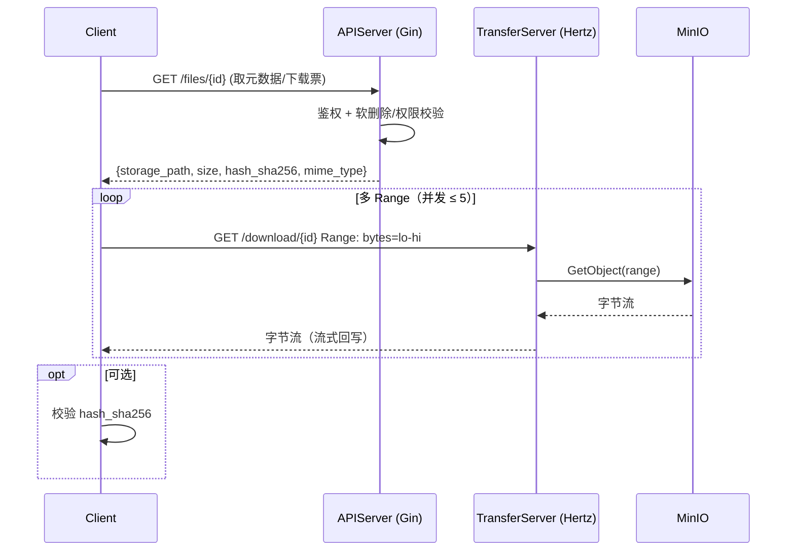
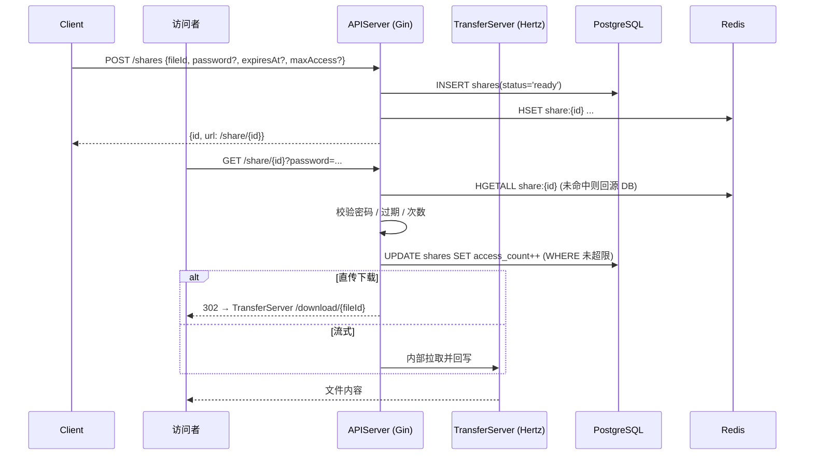
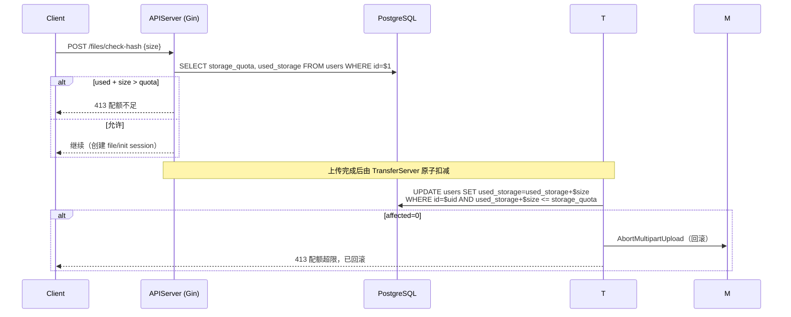

# NimbusDrive 设计文档 v1

> 状态：已启动 | 日期：2026-08-16
> 项目名：NimbusDrive | GitHub 仓库：https://github.com/Demetrius2107/NimbusDrive.git
> 依赖：《立项决策与规划》v1、《实现方案》v1、《接口文档》v1
> 用途：在动代码前固化领域模型、表结构（DDL）、服务边界、核心流程时序、状态机持久化、并发与一致性策略。本文是数据层与服务层的施工蓝图。

---

## 一、范围与依赖

- 覆盖 MVP（P1）五大核心场景：上传（分块/断点续传/秒传）、下载（Range 直传）、分享、配额、文件列表，外加文件夹管理与回收站。
- 不覆盖：磁力/BT（P1/P2）、WebDAV/S3/FTP/IPFS 协议网关（P2+）、团队协作（P4）。
- 对《实现方案》的两处偏离已在第十章列出（分享持久化、月度配额语义），并以本文为准。

---

## 二、领域模型

### 2.1 聚合根与实体

| 聚合根 | 职责 | 关键不变量 |
|--------|------|-----------|
| **User** | 用户身份、配额、角色 | `used_storage ≤ storage_quota`（软约束，上传完成时强校验） |
| **FileNode** | 文件或文件夹节点（用户视图） | 同目录下未删除节点名唯一；文件夹 `hash_sha256` 为 NULL |
| **FileHash** | 全局物理存储引用（去重） | `ref_count ≥ 0`；`ref_count = 0` 时物理存储可回收 |
| **UploadSession** | 一次分块上传会话（断点续传载体） | `uploaded_chunks ⊆ {0..total_chunks-1}`；会话过期后不可继续 |
| **Share** | 分享链接（短 ID + 密码 + 过期 + 次数） | `access_count ≤ max_access`（当 `max_access` 非空） |

### 2.2 值对象与枚举

```text
FileStatus     = init | uploading | merging | validating | completed | failed | cancelled
UploadStatus   = active | completed | aborted | expired
ShareStatus    = ready | active | expired | cancelled
```

### 2.3 领域事件（用于解耦与异步化，MVP 可同步实现）

- `FileUploaded`（文件完成上传，落库 + 配额扣减后触发）
- `FileDeleted`（软删除，触发回收站定时清理候选）
- `HashRefChanged`（`ref_count` 变动，`ref_count = 0` 触发物理对象 GC）
- `ShareAccessed`（分享被访问，`access_count++`，接近上限时预警）
- `QuotaWarning`（使用率 ≥ 95% 触发提醒）

---

## 三、服务边界（双服务拆分）

### 3.1 服务划分

| 服务 | 框架 | 监听（默认） | 承载模块 | 数据所有权 |
|------|------|------------|---------|-----------|
| **APIServer** | Gin | `:8080` | 用户/鉴权、管理端、配额、文件元数据 CRUD、分享、文件列表、回收站 | `users` / `files` / `file_hashes` / `shares` / `operation_logs` 的"业务语义"权威 |
| **TransferServer** | Hertz | `:8081` | 上传分块接收与合并、下载 Range 直传、上传会话状态机 | `upload_sessions` / `upload_chunks` 的会话状态权威；上传完成时**写回** `files` / `file_hashes` / `users.used_storage` |

### 3.2 共享与私有包布局

```text
NimbusDrive/
├── cmd/
│   ├── apiserver/         # Gin 服务入口
│   └── transferserver/    # Hertz 服务入口
├── internal/
│   ├── domain/            # 聚合根、枚举、错误码（两服务共享）
│   ├── store/             # sqlx + pgx 数据访问层（核心链路）
│   │   ├── user.go
│   │   ├── file.go
│   │   ├── filehash.go
│   │   ├── upload_session.go
│   │   └── share.go
│   ├── adminstore/        # GORM 模型（管理后台 CRUD 专用，不与 store 混用）
│   ├── storage/           # MinIO 客户端封装（分块上传/下载/直传）
│   ├── cache/             # go-redis 封装
│   ├── config/            # viper 配置加载
│   ├── logger/            # zap 封装
│   └── middleware/        # 各服务自有中间件（鉴权/限流/日志/recovery）
├── pkg/                   # 可对外暴露的工具（如错误响应结构）
├── configs/               # 配置文件
├── migrations/            # SQL 迁移脚本（DDL）
└── go.mod
```

### 3.3 跨服务交互方式

- **MVP（同步、共享 store）**：TransferServer 完成分块合并后，直接通过 `internal/store` 写回 `files` / `file_hashes` / `users.used_storage`（同一 DB，本地事务）。两服务共享同一份 store 代码，避免引入 RPC/消息队列的复杂度。
- **后期（异步、事件驱动）**：`FileUploaded` 等事件改为走 asynq（Redis 后端）异步处理，APIServer 订阅。MVP 不实现，但领域事件已预留。
- **对外统一入口**：生产环境用反向代理（Nginx/Traefik）将 `/api/v1/upload/*`、`/api/v1/download/*` 路由到 TransferServer，其余路由到 APIServer；开发期可前端直连两端口。

> ⚠️ 中间件不可共享：`gin.Context` 与 `hertz app.RequestContext` 类型不同，JWT/限流/日志/recovery 各服务实现薄层，逻辑可抽到 `internal/middleware` 的纯函数（接收通用参数），框架适配层各自包装。

---

## 四、数据库设计（DDL）

### 4.1 枚举类型

```sql
CREATE TYPE file_status AS ENUM (
  'init', 'uploading', 'merging', 'validating', 'completed', 'failed', 'cancelled'
);
CREATE TYPE upload_session_status AS ENUM (
  'active', 'completed', 'aborted', 'expired'
);
CREATE TYPE share_status AS ENUM (
  'ready', 'active', 'expired', 'cancelled'
);
```

### 4.2 users

```sql
CREATE TABLE users (
  id              BIGSERIAL    PRIMARY KEY,
  username        VARCHAR(64)  NOT NULL UNIQUE,
  email           VARCHAR(255) NOT NULL UNIQUE,
  password_hash   VARCHAR(255) NOT NULL,
  storage_quota   BIGINT       NOT NULL DEFAULT 0,   -- 字节；0 = 未分配
  used_storage    BIGINT       NOT NULL DEFAULT 0,   -- 字节；持久累计，不按月重置
  status          SMALLINT     NOT NULL DEFAULT 1,   -- 1=active, 0=disabled
  is_admin        BOOLEAN      NOT NULL DEFAULT FALSE,
  created_at      TIMESTAMPTZ  NOT NULL DEFAULT now(),
  updated_at      TIMESTAMPTZ  NOT NULL DEFAULT now()
);
COMMENT ON COLUMN users.used_storage IS '已用存储，持久累计；月度传输配额另见表（如启用）';
```

### 4.3 file_hashes（全局去重，物理存储引用计数）

```sql
CREATE TABLE file_hashes (
  hash_sha256    CHAR(64)      PRIMARY KEY,
  storage_path   VARCHAR(1024) NOT NULL,             -- MinIO 对象 key
  size           BIGINT        NOT NULL,
  ref_count      INTEGER       NOT NULL DEFAULT 0,
  created_at     TIMESTAMPTZ   NOT NULL DEFAULT now()
);
CREATE INDEX idx_file_hashes_ref_zero ON file_hashes(ref_count) WHERE ref_count = 0;
```

### 4.4 files（文件/文件夹节点，用户视图）

```sql
CREATE TABLE files (
  id             BIGSERIAL     PRIMARY KEY,
  user_id        BIGINT        NOT NULL REFERENCES users(id) ON DELETE CASCADE,
  parent_id      BIGINT        REFERENCES files(id) ON DELETE CASCADE,  -- NULL = 根目录
  name           VARCHAR(255)  NOT NULL,
  size           BIGINT        NOT NULL DEFAULT 0,
  mime_type      VARCHAR(128)  NOT NULL DEFAULT 'application/octet-stream',
  is_folder      BOOLEAN       NOT NULL DEFAULT FALSE,
  hash_sha256    CHAR(64)      REFERENCES file_hashes(hash_sha256),     -- 文件夹为 NULL
  chunk_count    INTEGER       NOT NULL DEFAULT 0,
  status         file_status   NOT NULL DEFAULT 'init',
  storage_path   VARCHAR(1024),                                       -- 冗余自 file_hashes，便于直传查询
  deleted_at     TIMESTAMPTZ,                                         -- 软删除（回收站）
  created_at     TIMESTAMPTZ   NOT NULL DEFAULT now(),
  updated_at     TIMESTAMPTZ   NOT NULL DEFAULT now()
);
-- 同目录下未删除节点名唯一（PostgreSQL 中 NULL 不参与唯一约束，故用部分索引）
CREATE UNIQUE INDEX idx_files_unique_name
  ON files(user_id, parent_id, name) WHERE deleted_at IS NULL;
CREATE INDEX idx_files_user_parent ON files(user_id, parent_id) WHERE deleted_at IS NULL;
CREATE INDEX idx_files_hash        ON files(hash_sha256) WHERE hash_sha256 IS NOT NULL;
CREATE INDEX idx_files_inprogress  ON files(user_id, status) WHERE status IN ('init','uploading','merging','validating');
CREATE INDEX idx_files_deleted     ON files(deleted_at) WHERE deleted_at IS NOT NULL;
```

### 4.5 upload_sessions（断点续传会话）

```sql
CREATE TABLE upload_sessions (
  id               UUID         PRIMARY KEY DEFAULT gen_random_uuid(),
  user_id          BIGINT       NOT NULL REFERENCES users(id) ON DELETE CASCADE,
  file_id          BIGINT       NOT NULL REFERENCES files(id) ON DELETE CASCADE,
  hash_sha256      CHAR(64)     NOT NULL,            -- 客户端预算的预期哈希
  total_size       BIGINT       NOT NULL,
  chunk_size       INTEGER      NOT NULL DEFAULT 4194304,  -- 4MB
  total_chunks     INTEGER      NOT NULL,
  uploaded_chunks  BYTEA,                             -- 位图：已收分块位图（MVP 方案）
  status           upload_session_status NOT NULL DEFAULT 'active',
  expires_at       TIMESTAMPTZ  NOT NULL DEFAULT (now() + interval '24 hours'),
  created_at       TIMESTAMPTZ  NOT NULL DEFAULT now(),
  updated_at       TIMESTAMPTZ  NOT NULL DEFAULT now()
);
CREATE INDEX idx_upload_sessions_user   ON upload_sessions(user_id, status);
CREATE INDEX idx_upload_sessions_expire ON upload_sessions(expires_at) WHERE status = 'active';
```

### 4.6 upload_chunks（可选：分块级追踪，支持并发与 ETag 校验）

```sql
CREATE TABLE upload_chunks (
  session_id     UUID         NOT NULL REFERENCES upload_sessions(id) ON DELETE CASCADE,
  chunk_index    INTEGER      NOT NULL,
  size           BIGINT       NOT NULL,
  etag           VARCHAR(255),                       -- MinIO 分块 ETag
  received_at    TIMESTAMPTZ  NOT NULL DEFAULT now(),
  PRIMARY KEY (session_id, chunk_index)
);
```

> **MVP 选型**：用 `upload_sessions.uploaded_chunks` 位图（10GB/4MB ≈ 2500 块 ≈ 313 字节），实现简单；并发收块时对会话行 `SELECT ... FOR UPDATE` 后置位。
> **规模扩展**：改用 `upload_chunks` 表（每块一行），支持高并发无锁写入与 ETag 校验。两方案不互斥，可并存。

### 4.7 shares（分享，PG 为源、Redis 缓存）

```sql
CREATE TABLE shares (
  id             VARCHAR(16)  PRIMARY KEY,           -- 短 ID 6-8 位，防枚举
  user_id        BIGINT       NOT NULL REFERENCES users(id) ON DELETE CASCADE,
  file_id        BIGINT       NOT NULL REFERENCES files(id) ON DELETE CASCADE,
  password_hash  VARCHAR(255),                       -- NULL = 无密码
  expires_at     TIMESTAMPTZ,                        -- NULL = 永久
  max_access     INTEGER,                            -- NULL = 不限次数
  access_count   INTEGER      NOT NULL DEFAULT 0,
  status         share_status NOT NULL DEFAULT 'ready',
  created_at     TIMESTAMPTZ  NOT NULL DEFAULT now(),
  updated_at     TIMESTAMPTZ  NOT NULL DEFAULT now()
);
CREATE INDEX idx_shares_user   ON shares(user_id, status);
CREATE INDEX idx_shares_expire ON shares(expires_at) WHERE status IN ('ready','active');
```

> **对《实现方案》的偏离**：实现方案将分享仅放 Redis。本文改为 **PG 为事实源 + Redis 缓存**，理由：分享是用户资产，Redis 重启丢失不可接受；管理端需查询/吊销分享；`access_count` 需持久化。Redis 仍用于热点分享的密码校验与限流。

### 4.8 operation_logs（管理端审计）

```sql
CREATE TABLE operation_logs (
  id             BIGSERIAL    PRIMARY KEY,
  actor_id       BIGINT,                              -- 用户/管理员 ID
  actor_type     VARCHAR(16)  NOT NULL,               -- 'user' / 'admin' / 'system'
  action         VARCHAR(64)  NOT NULL,               -- 如 'file.delete'
  target_type    VARCHAR(32),
  target_id      VARCHAR(64),
  ip             INET,
  detail         JSONB,
  created_at     TIMESTAMPTZ  NOT NULL DEFAULT now()
);
CREATE INDEX idx_logs_actor  ON operation_logs(actor_id, created_at DESC);
CREATE INDEX idx_logs_action ON operation_logs(action, created_at DESC);
```

### 4.9 递归 CTE：目录树

```sql
-- 子树：给定 folder_id，取其下所有后代（含子文件夹与文件）
WITH RECURSIVE subtree AS (
  SELECT id, parent_id, name, is_folder, size, 0 AS depth
  FROM files WHERE id = $1 AND deleted_at IS NULL
  UNION ALL
  SELECT f.id, f.parent_id, f.name, f.is_folder, f.size, s.depth + 1
  FROM files f
  JOIN subtree s ON f.parent_id = s.id
  WHERE f.deleted_at IS NULL
)
SELECT * FROM subtree ORDER BY depth, name;

-- 路径：给定 node_id，取从根到该节点的完整路径（面包屑）
WITH RECURSIVE path AS (
  SELECT id, parent_id, name, 0 AS depth
  FROM files WHERE id = $1
  UNION ALL
  SELECT f.id, f.parent_id, f.name, p.depth + 1
  FROM files f
  JOIN path p ON p.parent_id = f.id
)
SELECT * FROM path ORDER BY depth DESC;
```

---

## 五、缓存设计（Redis）

| Key 模式 | 类型 | 用途 | 过期 |
|---------|------|------|------|
| `hash:{sha256}` | String | 秒传命中缓存（值 = `storage_path` 或 `MISS`） | 10 min（MISS 短缓存防穿透 60s） |
| `session:{uid}` | String | 用户会话/JWT 指纹 | 与 JWT TTL 一致 |
| `uploadsess:{id}` | Hash | 上传会话热镜像（total/uploaded/status） | 与 `expires_at` 一致 |
| `share:{id}` | Hash | 分享热缓存（fileId/pwdHash/expire/maxAccess/count） | 到 `expires_at`；永久则 1h |
| `ratelimit:{uid}:{route}` | 计数 | 接口限流 | 滑动窗口 |
| `quota:{uid}` | String | used_storage 热读缓存（写穿透回 PG） | 5 min |

---

## 六、对象存储设计（MinIO）

### 6.1 Bucket 与对象 key 规范

- Bucket：`nimbus-drive`（生产可按租户/区域分桶，MVP 单桶）。
- 对象 key：`blobs/{hash_sha256[:2]}/{hash_sha256[2:4]}/{hash_sha256}` —— 按哈希前缀分目录，避免单层对象过多；全局去重（同哈希只存一份）。

### 6.2 分块上传映射

- TransferServer 用 MinIO **Multipart Upload**：`CreateMultipartUpload` → 每块 `UploadPart`（`PartNumber = chunk_index + 1`）→ `CompleteMultipartUpload`。
- `upload_chunks.etag` 存 MinIO 返回的 ETag，用于 `CompleteMultipartUpload` 时校验。
- 断点续传：客户端 `GET /upload/{sessionId}` 返回未收块索引列表，客户端仅补传缺失块；MinIO 侧已上传的 Part 保留（Multipart Upload 默认保留直至 Complete 或 Abort）。

### 6.3 下载直传

- 下载不经服务端中转大流量：TransferServer 用 MinIO `GetObject(range)` 流式回写给客户端，或对公开对象签发**预签名 URL**让客户端直连 MinIO（P2 优化，MVP 先走流式）。

---

## 七、核心流程时序图

### 7.1 上传（秒传判定 + 分块 + 断点续传 + 合并）

```mermaid
sequenceDiagram
    participant C as Client
    participant A as APIServer (Gin)
    participant T as TransferServer (Hertz)
    participant M as MinIO
    participant DB as PostgreSQL
    participant R as Redis

    C->>C: 计算 hash_sha256 (Web Worker)
    C->>A: POST /files/check-hash {hash, size, name, parent_id}
    A->>R: GET hash:{sha256}
    alt 缓存命中
        A->>DB: SELECT file_hashes WHERE hash_sha256=$1
        note over A: 命中 → 秒传
        A->>DB: INSERT files(status='completed', hash_sha256, ref_count++)
        A-->>C: {instant:true, fileId}
    else 未命中
        A->>DB: INSERT files(status='init'); INSERT upload_sessions(status='active')
        A-->>C: {sessionId, fileId, chunkSize, totalChunks}
        loop 每个分块（并发 ≤ 5）
            C->>T: PUT /upload/{sessionId}/chunks/{index} (流式)
            T->>M: UploadPart(PartNumber=index+1)
            T->>DB: UPDATE upload_sessions.uploaded_chunks 置位 (FOR UPDATE)
        end
        alt 中断后恢复
            C->>T: GET /upload/{sessionId}
            T-->>C: {missing:[...未收块索引]}
            note over C: 仅补传缺失块
        end
        C->>T: POST /upload/{sessionId}/complete
        T->>M: CompleteMultipartUpload
        T->>T: 校验 size / hash_sha256
        T->>DB: 事务: INSERT/UPDATE file_hashes(ref_count++); UPDATE files(status='completed'); UPDATE users.used_storage += size
        T->>R: SET hash:{sha256}=storage_path
        T-->>C: {fileId, storage_path, hash_sha256}
    end
```

### 7.2 下载（Range 直传）



### 7.3 分享（创建与访问）



### 7.4 配额校验（上传前置 + 完成扣减）



---

## 八、状态机（持久化字段）

引用《实现方案》3.1 的三态机，此处标注持久化载体：

- **文件状态机** → 持久化于 `files.status`。终态 `completed/failed/cancelled`。
- **上传会话状态机** → 持久化于 `upload_sessions.status`：`active` → `completed`（合并成功）/ `aborted`（用户取消）/ `expired`（定时任务扫描 `expires_at`）。
- **分享状态机** → 持久化于 `shares.status`：`ready` → `active`（首次访问）→ `expired`（到期/超次）/ `cancelled`（用户/管理员吊销）。

定时任务（APIServer 内 cron）：
1. 过期上传会话清理：`status='active' AND expires_at < now()` → `expired`，并 Abort 对应 MinIO Multipart Upload。
2. 回收站清理：`deleted_at < now() - interval '30 days'` → 物理删除，`file_hashes.ref_count--`。
3. `ref_count = 0` 的 `file_hashes` → 删除 MinIO 对象 + 删行。

---

## 九、并发与一致性策略

| 场景 | 策略 |
|------|------|
| 秒传 `ref_count++` | `INSERT ... ON CONFLICT(hash_sha256) DO UPDATE SET ref_count=ref_count+1` 原子操作 |
| `ref_count--` 与物理回收 | 先 `UPDATE ... SET ref_count=ref_count-1`，再 `DELETE WHERE ref_count=0`；物理对象 GC 由定时任务兜底，避免请求路径内删对象 |
| 配额扣减 | 原子条件更新：`UPDATE users SET used_storage=used_storage+$1 WHERE id=$2 AND used_storage+$1<=storage_quota`；`affected=0` 即超限回滚 |
| 上传会话位图更新 | `SELECT ... FOR UPDATE` 锁会话行后置位，防并发覆盖 |
| 同目录同名冲突 | 部分唯一索引 `idx_files_unique_name` 兜底；应用层先查后插仍可能冲突，依赖 `ON CONFLICT` 或捕获唯一约束错误 |
| 目录移动/重命名 | 单事务内递归更新 `parent_id`；路径不物化（用递归 CTE 实时算），避免移动时的级联写 |
| `storage_path` 冗余 | 由应用层在写 `files` 时同步填充；可加触发器保持与 `file_hashes.storage_path` 一致（MVP 用应用层） |
| 分享 `access_count++` | `UPDATE ... SET access_count=access_count+1 WHERE id=$1 AND (max_access IS NULL OR access_count < max_access)`；`affected=0` 即超限 |

---

## 十、设计决策与待确认项

| # | 决策 | 取向 | 备注 |
|---|------|------|------|
| 1 | 回收站软删除 | ✅ 采用 | `files.deleted_at`；30 天后物理清理 |
| 2 | 分享持久化 | ✅ PG 为源 + Redis 缓存 | **偏离《实现方案》** 的纯 Redis 方案，以本文为准 |
| 3 | 月度配额重置语义 | ⚠️ 待确认 | 《实现方案》边界条件提"每月1号重置配额"，但 `used_storage` 是持久存储用量不应重置。本文按"存储配额不重置"实现；若需月度**传输**配额，另建 `quota_periods(uid, period, bytes_used)` 表，P2 再加 |
| 4 | 跨服务元数据写 | MVP 同步共享 store | 上传完成由 TransferServer 直接写 `files/file_hashes/users`；已实现 Redis Streams 事件总线（feat/async-events），核心事务后发 `file.uploaded` 等事件，APIServer 内嵌消费者做审计/统计/对账 |
| 5 | `storage_path` 冗余 | ✅ 保留 | 用空间换直传查询速度，应用层维护一致性 |
| 6 | 分块追踪 | MVP 位图 | 规模化时叠加 `upload_chunks` 表 |
| 7 | 下载直传方式 | MVP 流式 | P2 改预签名 URL 直连 MinIO |

---

## 修订记录

| 日期 | 变更 |
|--------|------|
| 2026-08-16 | v1 初稿：领域模型、双服务边界、DDL（含索引与递归 CTE）、缓存/对象存储设计、核心时序、状态机持久化、并发策略、决策与待确认项 |
